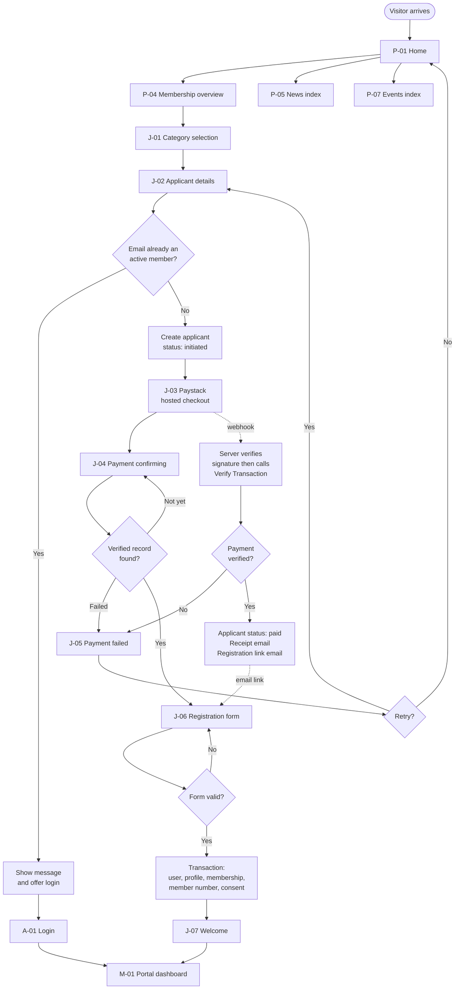
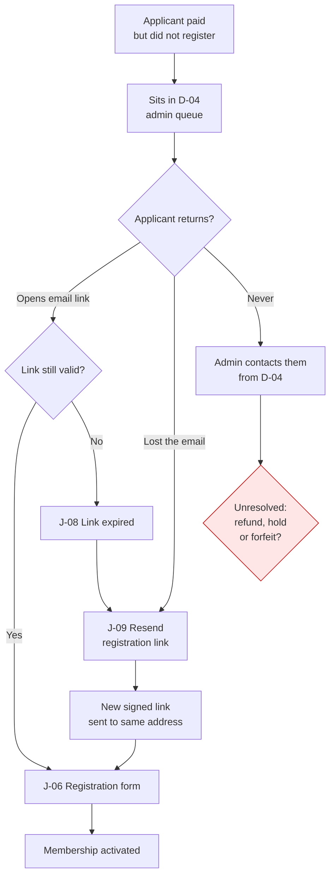
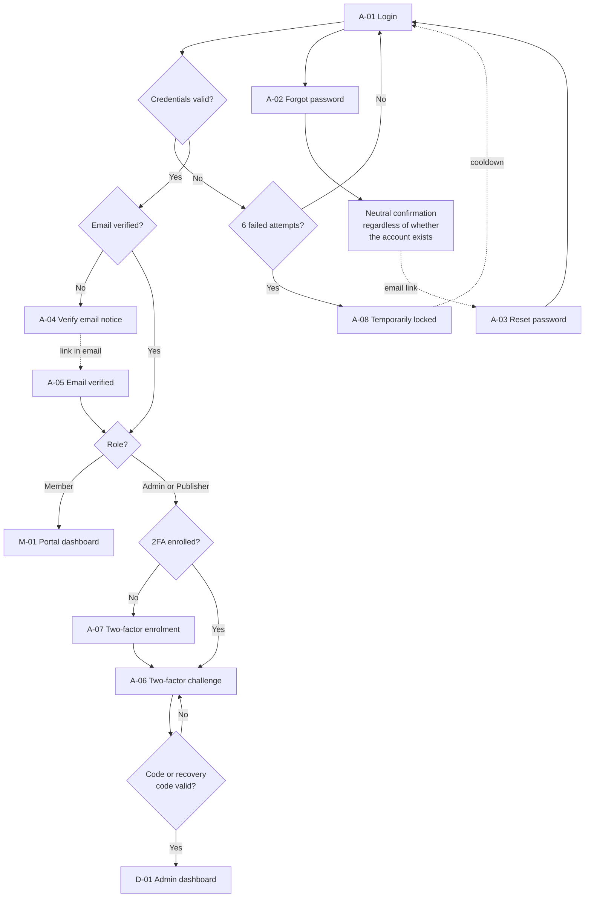
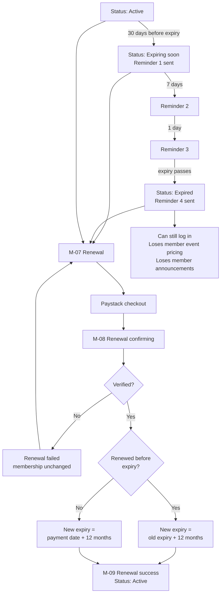
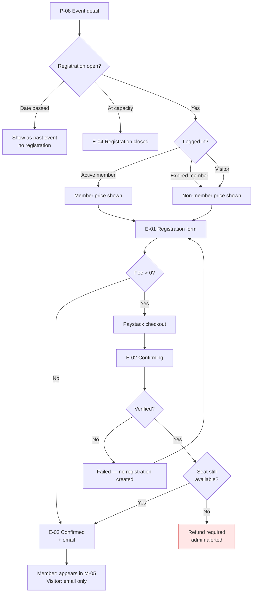
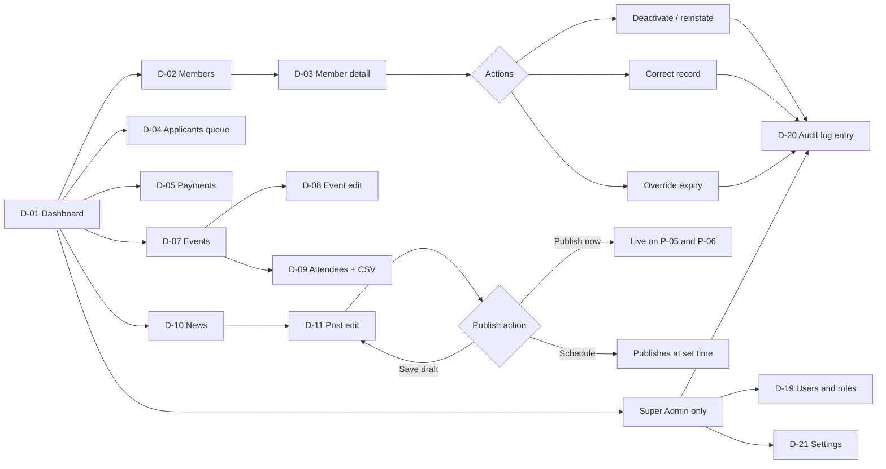

# ALDAPCON Platform — App Flow (V1)

**Product:** ALDAPCON — Association of Data Protection Compliance Organizations of Nigeria
**Document:** 03-app-flow.md
**Companion to:** 01-prd.md, 02-trd.md (both approved, unchanged)
**Version:** 1.1
**Status:** Approved, corrected per `08-spec-audit.md`
**Owner:** Product Design

> **v1.1 incorporates** change set 01 (six new screens for certificate verification) and audit corrections BC-3, BC-6, BC-7, IG-7.

> Every screen below traces to a numbered requirement in the PRD. Where the PRD implies a screen without stating it, or where two requirements conflict, it is flagged in **Section 6** rather than resolved by guesswork. Section 6 is the part of this document that needs your decisions.

---

## 1. Journey Summary

### The primary journey — a stranger becomes a member

Somebody hears about ALDAPCON and lands on the home page. They read enough to take it seriously: who runs it, what it stands for, recent news that shows it is alive. They open the Membership page, compare categories, and find the one that matches them — an individual DPO or a licensed compliance organisation.

They tap Join. They give their name, email and phone — the minimum needed to attach a payment to a human — and go straight to Paystack's hosted checkout. They pay by card or transfer.

They come back to a confirming screen that waits for the payment to be verified server-side. Once it clears, two emails arrive: a receipt, and a link to finish registration. If they carry straight on, they fill in the full registration form — organisation, job title, qualifications, licence number if a DPCO, location — agree to the processing terms, and submit.

Their membership activates immediately. They get a membership number, an active status, an expiry date twelve months out, and a welcome email. They land in their portal with all of it visible.

If instead they closed the tab after paying, nothing is lost. The registration link in their inbox brings them back to exactly the same form, days or weeks later. The secretariat sees them in the meantime as *paid, awaiting registration* — a queue somebody watches, not a black hole.

### What members do afterwards

They log in to check their status, download a receipt for expenses, register for an event at member pricing, and read the news. Thirty days before expiry the reminders start, and renewal is a few taps from the portal.

### What visitors do without joining

They read news, browse events, and register for events at non-member pricing without ever creating an account. They can contact the association. They can subscribe to the newsletter. All of that is deliberately open — it is the top of the funnel.

### What administrators do

They open a dashboard that answers the association's real question — how many members, in what state, and how much money — then work through three queues: applicants awaiting registration, payments needing reconciliation, and enquiries. They publish news and events. They correct member records when someone emails to say their organisation changed. Everything they change is written to an audit log.

### The shape of the whole thing

Three surfaces, one codebase: **a public site anyone can read**, **a member portal behind login**, and **an admin back office behind login plus two-factor**. The signup flow is the bridge from the first to the second. No other path creates a member.

---

## 2. Screen Inventory

### 2.1 Public site

| ID | Screen | Route | Auth | Requirement |
|---|---|---|---|---|
| P-01 | Home | `/` | Public | FR-1.1, FR-1.2 |
| P-02 | About Us | `/about` | Public | FR-1.1 |
| P-03 | Leadership / Executive Council | `/leadership` | Public | FR-1.1, FR-1.3 |
| P-04 | Membership overview | `/membership` | Public | FR-1.4, FR-2.1 |
| P-05 | News index | `/news` | Public | FR-7.3 |
| P-06 | News post | `/news/{slug}` | Public | FR-7.4 |
| P-07 | Events index | `/events` | Public | FR-8.3 |
| P-08 | Event detail | `/events/{slug}` | Public | FR-8.3 |
| P-09 | FAQ | `/faq` | Public | FR-1.1 |
| P-10 | Contact | `/contact` | Public | FR-11.1, FR-11.3 |
| P-11 | Search results | `/search?q=` | Public | FR-1.6 |
| P-12 | Privacy Policy | `/privacy-policy` | Public | FR-12.4 |
| P-13 | Cookie Policy | `/cookie-policy` | Public | FR-12.4 |
| P-14 | Terms of Use | `/terms` | Public | FR-12.4 |
| P-15 | 404 Not Found | any | Public | AC-F1 |
| P-16 | 500 / maintenance | any | Public | NFR 6.4 |
| P-17 | Newsletter confirmation landing | `/newsletter/confirm/{token}` | Public | FR-7.5 — **derived, see G-2** |

### 2.2 Signup and payment

| ID | Screen | Route | Auth | Requirement |
|---|---|---|---|---|
| J-01 | Category selection | `/join` | Public | FR-3.1 |
| J-02 | Applicant details | `/join/{category}` | Public | FR-3.1, FR-3.2 |
| J-03 | Paystack hosted checkout | external | Public | FR-3.3 |
| J-04 | Payment confirming | `/join/confirming/{reference}` | Public | FR-3.4 |
| J-05 | Payment failed | `/join/failed/{reference}` | Public | FR-3.9 |
| J-06 | Registration form | `/join/register/{signedToken}` | Signed link | FR-3.6 |
| J-07 | Registration success / welcome | `/join/welcome` | Session | FR-3.7 |
| J-08 | Registration link invalid or expired | `/join/register/{token}` fallback | Public | FR-3.8 — **partial, see G-3** |
| J-09 | Resend registration link | `/join/resend` | Public | **derived, see G-3** |
| **J-10** | **Application received — pending verification** | `/join/pending` | Session | FR-3.7, FR-5.1 |
| **J-11** | **Application rejected** | `/portal` variant | Member session | FR-3.13.4 |
| **J-12** | **Corrected document upload** | `/join/document/{signedToken}` | Signed link | FR-3.13.5 |

### 2.3 Authentication

| ID | Screen | Route | Auth | Requirement |
|---|---|---|---|---|
| A-01 | Login | `/login` | Public | FR-4.1, FR-4.2 |
| A-02 | Forgot password | `/forgot-password` | Public | FR-4.2 |
| A-03 | Reset password | `/reset-password/{token}` | Signed link | FR-4.2 |
| A-04 | Email verification notice | `/verify-email` | Session | FR-4.2 |
| A-05 | Email verified confirmation | `/verify-email/{id}/{hash}` | Signed link | FR-4.2 |
| A-06 | Two-factor challenge | `/two-factor-challenge` | Partial session | FR-4.3 |
| A-07 | Two-factor enrolment | `/admin/two-factor-setup` | Admin session | FR-4.3 — **derived, see G-4** |
| A-08 | Account locked | inline on `/login` | Public | FR-4.5, AC-F4 |
| A-09 | 403 Forbidden | any | Any | FR-9.7, AC-F4 |

### 2.4 Member portal

| ID | Screen | Route | Auth | Requirement |
|---|---|---|---|---|
| M-01 | Portal dashboard | `/portal` | Member | FR-5.1 |
| M-02 | Profile view and edit | `/portal/profile` | Member | FR-5.2 |
| M-03 | Payments and receipts | `/portal/payments` | Member | FR-5.3 |
| M-04 | Receipt PDF | `/portal/payments/{id}/receipt` | Member | AC-F5 |
| M-05 | My event registrations | `/portal/events` | Member | FR-5.4 |
| M-06 | Member announcements | `/portal/announcements` | Member | FR-5.5 |
| M-07 | Renewal | `/portal/renew` | Member | FR-5.6, FR-6.4 |
| M-08 | Renewal confirming | `/portal/renew/confirming/{reference}` | Member | FR-3.4 |
| M-09 | Renewal success | `/portal/renew/success` | Member | FR-6.4 |
| M-10 | Data request (export / erasure) | `/portal/data-requests` | Member | FR-12.3 |
| M-11 | Security settings | `/portal/security` | Member | **derived, see G-5** |

### 2.5 Event registration

| ID | Screen | Route | Auth | Requirement |
|---|---|---|---|---|
| E-01 | Event registration form | `/events/{slug}/register` | Public or Member | FR-8.4 |
| E-02 | Event payment confirming | `/events/{slug}/confirming/{reference}` | Public or Member | FR-8.5 |
| E-03 | Event registration confirmed | `/events/{slug}/confirmed` | Public or Member | FR-8.7 |
| E-04 | Event registration closed | inline on P-08 | Public | FR-8.6 |

### 2.6 Admin back office

| ID | Screen | Route | Role | Requirement |
|---|---|---|---|---|
| D-01 | Admin dashboard | `/admin` | Admin, Super | FR-9.1 |
| D-02 | Members list | `/admin/members` | Admin, Super | FR-9.2 |
| D-03 | Member detail | `/admin/members/{id}` | Admin, Super | FR-9.3, FR-9.4 |
| D-04 | Applicants — paid, awaiting registration | `/admin/applicants` | Admin, Super | FR-3.8, FR-9.1 |
| D-05 | Payments | `/admin/payments` | Admin, Super | FR-9.6 |
| D-06 | Membership categories | `/admin/categories` | Admin, Super | FR-2.2 |
| D-07 | Events list | `/admin/events` | Admin, Super, Publisher | FR-8.1 |
| D-08 | Event create / edit | `/admin/events/{id}/edit` | Admin, Super, Publisher | FR-8.1, FR-8.2 |
| D-09 | Event attendees | `/admin/events/{id}/attendees` | Admin, Super | FR-8.8 |
| D-10 | News list | `/admin/news` | All three | FR-7.1 |
| D-11 | News create / edit | `/admin/news/{id}/edit` | All three | FR-7.1, FR-7.2 |
| D-12 | Pages | `/admin/pages` | All three | FR-10 (content editability), NFR 6.6 |
| D-13 | Leadership profiles | `/admin/leadership` | All three | FR-1.3 |
| D-14 | FAQ management | `/admin/faqs` | All three | FR-1.1 |
| D-15 | Member announcements | `/admin/announcements` | Admin, Super | FR-5.5 — **see G-6** |
| D-16 | Enquiries | `/admin/enquiries` | Admin, Super | FR-11.2 |
| D-17 | Newsletter subscribers | `/admin/subscribers` | Admin, Super | FR-7.5, FR-10.3 |
| D-18 | Data subject requests | `/admin/data-requests` | Admin, Super | FR-12.3 |
| D-19 | Users and roles | `/admin/users` | Super only | FR-9.7 |
| D-20 | Audit log | `/admin/audit-log` | Super only | FR-9.8 |
| D-21 | Settings | `/admin/settings` | Super only | NFR 6.6 |
| **D-22** | **Verification queue** | `/admin/verifications` | Admin, Super | FR-3.13.1 |
| **D-23** | **Application review** | `/admin/verifications/{id}` | Admin, Super | FR-3.13.3–5 |
| **D-24** | **Certificate stream** | `/admin/documents/{uuid}` | Admin, Super | FR-3.13.2 |

### 2.7 Global overlays

| ID | Component | Appears | Requirement |
|---|---|---|---|
| G-01 | Cookie consent banner | First visit, all public pages | FR-12.1 |
| G-02 | Cookie preferences (re-callable) | Footer link, any page | FR-12.1 |
| G-03 | Primary navigation | All public pages | FR-1.5 |
| G-04 | Footer | All public pages | FR-1.5, FR-12.4 |
| G-05 | Search field | Header, all public pages | FR-1.6 |
| G-06 | Newsletter signup block | News section | FR-7.5 |

**Total: 82 screens and components.** Nothing here comes from the original brief's excluded features — there is no certificate screen, no QR verification page, no member directory, no chapters, no jobs board, no elections.

---

## 3. Flowcharts

### 3.1 Primary journey — visitor to active member

### 3.2 The abandoned-payment path

The red node is PRD open question **Q4**. Until it is answered, this flow has no terminal state for an applicant who never returns.

### 3.3 Authentication

### 3.4 Membership lifecycle and renewal

### 3.5 Event registration

The red node is a genuine race condition. Mitigation is in TRD §4.3 — capacity decrement and registration insert in one locked transaction — but a payment can still succeed for a seat lost between checkout start and webhook arrival. That case needs a refund path, flagged as **G-8**.

### 3.6 Admin navigation

---

## 4. Screen-by-Screen Behaviour

Format for each: **Purpose · Reached from · Information shown · Primary action · Secondary actions · After each action · Next destination · States and edge cases.**

---

### 4.1 Public site

#### P-01 — Home `/`

**Purpose.** Establish credibility fast and route the visitor to Join.
**Reached from.** Direct, search, social, logo click from anywhere.
**Information.** Association positioning statement; primary "Join the association" call to action; three most recent published posts; up to three upcoming events; brief mission summary; contact prompt.
**Primary action.** Join the association → **J-01**.
**Secondary actions.** Read a post → P-06. View an event → P-08. About → P-02. Login → A-01. Search → P-11. Contact → P-10.
**After actions.** Straight navigation; no state change.
**States.**
- *Loading:* server-rendered, so effectively none. Images use width and height attributes to prevent layout shift.
- *Empty — no published posts:* the news block is hidden entirely, not shown with placeholder text. An empty slot reads as neglect.
- *Empty — no upcoming events:* the events block is replaced with a single line inviting newsletter signup, or hidden.
- *Error:* P-16.
**Edge cases.** Logged-in member sees "My portal" in place of "Login", and the Join call to action is replaced by a portal link — an active member being urged to join is a credibility bug. A logged-in admin sees a link to the admin dashboard.

#### P-02 — About Us `/about`

**Purpose.** History, vision, mission, objectives.
**Reached from.** Navigation, home.
**Information.** Editable long-form content from D-12.
**Primary action.** Join → J-01. **Secondary.** Leadership → P-03.
**States.** Standard. Content is admin-editable so must tolerate long and short bodies.

#### P-03 — Leadership `/leadership`

**Purpose.** Show who is accountable. For a compliance association this page does more persuading than any other.
**Information.** Each council member: photo, name, position, short bio, ordered by an admin-set sequence.
**Primary action.** Join → J-01.
**States.** *Empty:* the page is not linked in navigation until at least one profile exists. *Missing photo:* neutral initial-based placeholder, never a broken image. *Long bio:* truncate with expand.

#### P-04 — Membership overview `/membership`

**Purpose.** Let a visitor identify their category and its price.
**Information.** Each active category: name, applicant type, eligibility, benefits list, annual fee in Naira. Renewal terms. Link to FAQ.
**Primary action.** Join under a specific category → **J-02** for that category, skipping J-01.
**Secondary.** Generic Join → J-01. FAQ → P-09. Contact → P-10.
**States.** *Empty:* if no active category exists the Join calls to action are disabled with a "membership opens shortly" message — this is a launch-blocking configuration error and should also alert an admin. *Loading:* none.
**Edge cases.** Fee changes between page view and payment: the amount is always re-derived server-side at J-02, never carried from this page. Expired member viewing this page sees a renewal prompt rather than a join prompt.

#### P-05 — News index `/news`

**Information.** Paginated published posts, newest first, with title, excerpt, image, date, author, category. Category and tag filters. Newsletter signup block (G-06).
**Primary action.** Open a post → P-06.
**States.** *Empty overall:* honest single line, no fake placeholder cards. *Empty for a filter:* "No posts in this category yet" with a clear-filter action. *Paginated:* page 2+ carries `noindex`-safe canonical handling.
**Edge cases.** Scheduled posts must not appear before their time. Draft URLs must 404 for the public, not render (AC-F7).

#### P-06 — News post `/news/{slug}`

**Information.** Title, publish date, author, body, images, category and tags; share links; up to three related posts.
**Primary actions.** Share; subscribe to newsletter; Join.
**States.** *404:* unpublished, deleted or wrong slug → P-15. *Slug changed:* previous slug 301-redirects, otherwise every shared link the association has ever posted breaks.

#### P-07 — Events index `/events`

**Information.** Upcoming events first with date, title, location or virtual, price band; past events in a separate section, still accessible.
**Primary action.** Open an event → P-08.
**States.** *Empty upcoming:* show past events with a line about upcoming announcements. *Empty entirely:* single explanatory line.

#### P-08 — Event detail `/events/{slug}`

**Information.** Title, full description, date and time, end time, location or virtual link, speakers, cover image, capacity remaining if near full, member price and non-member price.
**Primary action.** Register → **E-01**.
**Secondary.** Add to calendar (ICS download — see G-20); share; login to get member pricing.
**States.**
- *Open:* register button active, showing the price applicable to this viewer.
- *At capacity:* **E-04** inline — button disabled, clear message.
- *Past:* registration section replaced with a past-event note; page remains live for SEO.
- *Free event:* price shown as Free, and E-01 skips payment.
**Edge cases.** A visitor sees the non-member price with a line noting members pay less and a login link — this is the single best conversion moment in the product. An **expired** member also sees the non-member price (AC-F6); the copy must explain why and link to M-07, not simply present them as a stranger. See **G-7**.

#### P-09 — FAQ `/faq`

**Information.** Admin-managed questions and answers, grouped, expand-collapse.
**States.** *Empty:* page unlinked from navigation until populated.

#### P-10 — Contact `/contact`

**Information.** Address, email, phone, map (OpenStreetMap per TRD §5), enquiry form: name, email, subject, message, spam protection.
**Primary action.** Send enquiry → validates → stores → emails the association → acknowledgement email to sender → success state replaces the form in place.
**States.** *Submitting:* button disabled with spinner; double submission prevented. *Validation error:* inline, field-level, described in text. *Spam challenge failure:* explain and allow retry. *Send failure:* apologise and show the direct email address as a fallback — never leave a person with a dead form.

#### P-11 — Search results `/search?q=`

**Information.** Matches across published posts, events and pages, grouped by type, with the query echoed.
**States.** *Empty query:* prompt rather than error. *No results:* suggest browsing news and events; do not present as a failure. *Long query:* truncate and sanitise.

#### P-12, P-13, P-14 — Legal pages

**Purpose.** FR-12.4. Versioned; the version shown at consent time is what the ConsentRecord snapshots.
**Reached from.** Footer, signup flow, cookie banner.
**Edge case.** When a policy is updated, the previous version must remain retrievable — a consent record pointing at a version nobody can read is not evidence of anything.

#### P-15 — 404

Offers navigation and search rather than a dead end. Returns a true 404 status.

#### P-16 — 500 / maintenance

Plain apology, association email address, no stack trace. `APP_DEBUG=false` in production is a launch gate (TRD §9).

#### P-17 — Newsletter confirmation landing `/newsletter/confirm/{token}`

**Derived screen — see G-2.** Double opt-in requires somewhere for the confirmation link to land.
**States.** Confirmed; already confirmed; invalid or expired token with a resubscribe option.

---

### 4.2 Signup and payment

#### J-01 — Category selection `/join`

**Purpose.** Route the applicant into the right category before any data is collected.
**Reached from.** Any Join call to action that did not specify a category.
**Information.** Each active category as a selectable card: name, who it is for, annual fee, key benefits.
**Primary action.** Continue with a selected category → **J-02**.
**Secondary.** Compare on P-04; FAQ.
**States.** *Nothing selected:* continue disabled. *Single category configured:* skip this screen entirely and go straight to J-02. *No active categories:* blocked state as in P-04.

#### J-02 — Applicant details `/join/{category}`

**Purpose.** Collect the minimum needed to tie a payment to a person (FR-3.2), then hand off to payment.
**Information.** Selected category and its fee, prominently, with a change-category link. Fields: full name, email, phone. Consent checkbox for processing, unbundled, unticked, linking to the current Privacy Policy. Separate optional marketing consent. A clear statement that payment comes first and registration details follow.
**Primary action.** Proceed to payment.
**What happens.**
1. Validate fields.
2. **Check for an existing active membership on this email (FR-3.10) — before payment, not after.** See **G-1**; this ordering is not optional.
3. Create the Applicant record, status `initiated`.
4. Record consent with policy version, timestamp, IP.
5. Call Paystack Initialize with the amount derived server-side from the category.
6. Redirect to **J-03**.
**Secondary.** Change category → J-01. Cancel → P-04.
**States.**
- *Validation errors:* inline, keyboard-accessible, announced.
- *Duplicate active member:* stop with a friendly message and two routes — log in (A-01), or contact us if this is an error. **No payment is initiated.**
- *Existing applicant, paid but unregistered, same email:* do not charge again. Offer to resend the registration link → **J-09**.
- *Paystack initialisation failure:* apologise, do not create a payment record, offer retry and the contact address.
- *Submitting:* button disabled, spinner, double-submission blocked at the server too.
**Edge cases.** Back-button return after redirecting to Paystack must not create a second applicant. Category deactivated between J-01 and J-02: block with an explanation.

#### J-03 — Paystack hosted checkout (external)

Not our screen. Our responsibilities: pass the correct amount, reference, email, and callback URL; brand where Paystack allows; ensure the callback returns to **J-04** with the reference.
**Edge cases.** Abandonment — no webhook ever arrives and the applicant stays `initiated`. **A payment record does exist**: it is created at Initialize with status `pending` and swept to `abandoned` by a scheduled job after a configured interval (FR-3.9, FR-3.14). This is what makes abandoned attempts visible in D-05 rather than vanishing (audit BC-3). Timeout. User uses the browser back button mid-payment — the callback must be idempotent.

#### J-04 — Payment confirming `/join/confirming/{reference}`

**Purpose.** Hold the applicant while the server confirms the payment properly. **This screen grants nothing.** It only reflects state (FR-3.4).
**Reached from.** Paystack callback redirect.
**Information.** Reassurance that the payment is being confirmed, the reference number, and a note that a receipt email is on its way.
**Behaviour.** Polls for a verified payment record on a short interval with a defined ceiling.
**Outcomes.**
- Verified → **J-06** if the session is intact, otherwise a "check your email for your registration link" state.
- Explicitly failed → **J-05**.
- Still pending at the ceiling → reassurance state: the payment may still complete, the receipt and registration link will arrive by email, here is the reference and the contact address. **Never** tell someone their payment failed when it is merely slow.
**States.** Confirming; confirmed; failed; taking longer than expected.
**Edge cases.** The applicant closes the tab here — covered, because the webhook path is independent of the browser. Refreshing must not re-trigger anything. Direct navigation with a forged reference shows a neutral not-found state, never another applicant's data.

#### J-05 — Payment failed `/join/failed/{reference}`

**Information.** What happened in plain language, that no money was taken or that any deduction will be reversed by the bank, the reference, and what to do next.
**Primary action.** Try again → back to **J-02** with details pre-filled and no duplicate applicant created.
**Secondary.** Contact us. Return home.
**Edge case.** Bank debits but the transaction fails at Paystack — the copy must acknowledge this possibility and give the reference and contact route rather than flatly asserting no money was taken.

#### J-06 — Registration form `/join/register/{signedToken}`

**Purpose.** Capture the full member record and activate membership (FR-3.6, FR-3.7).
**Reached from.** J-04 after verification, or the emailed signed link at any later time.
**Information.** Confirmation that payment succeeded and the category paid for. Fields per FR-3.6: full name (pre-filled, editable here — this is the last point it is self-editable), email (pre-filled, locked), phone (pre-filled), organisation, job title, professional qualifications, NDPC licence number (required only for DPCO applicant types), state and city, how they heard about the association. Password creation for the account. Final confirmation of terms.
**Verifying categories (change set 01).** Where the category has `requires_verification = true`, the form gains a certificate upload with accepted formats and size limit stated **above** the control, plus help text explaining that membership begins after review. The primary button changes to **"Submit for verification"** — promising immediate membership here would be a lie the next screen exposes.

**Primary action.** Complete registration, or Submit for verification.
**What happens.** In one transaction: create User, save MemberProfile, activate Membership, allocate the member number from a sequence, record consent. Then queue the welcome email and the admin notification. Then log the applicant in.
**Next destination.** **J-07** for non-verifying categories; **J-10** for verifying ones.
**States.**
- *Long form:* split into two or three steps with progress, saving partial input between steps so a dropped connection does not lose everything.
- *Validation errors:* inline; conditional requirement for the licence number must be explained, not silently enforced.
- *Submitting:* disabled button; server-side idempotency so a double submit yields one membership.
- *Token invalid or expired:* **J-08**.
- *Already completed:* if the membership already exists, redirect to A-01 with a message rather than showing an empty form.
- *Activation transaction fails:* nothing is half-created; the applicant sees an apology with their reference and the payment stays intact so they can retry. This must alert an admin — a paid applicant who cannot activate is the worst state in the product.
**Edge cases.** Password rules must be stated up front, not revealed by rejection. Email is locked because it is the payment's identity anchor; a change request goes through an admin.

#### J-07 — Welcome `/join/welcome`

**Information.** Membership number, category, status Active, expiry date, and what to do next: complete your profile, browse events, read the news.
**Primary action.** Go to my portal → **M-01**.
**States.** Shown once; a later direct visit redirects to M-01.
**Edge case.** The welcome email may arrive before or after this screen; neither should be the sole source of the membership number.

#### J-08 — Registration link invalid or expired

**Information.** Explains that the link is no longer valid and that the payment is safe.
**Primary action.** Send me a new link → **J-09**.
**Secondary.** Contact us.
**Flagged.** FR-3.8 says an applicant may return "at any time", which argues for no expiry at all — but an unexpiring signed link that creates an account is a security weakness. See **G-3**.

#### J-09 — Resend registration link `/join/resend`

**Derived screen — see G-3.**
**Information.** Email field only.
**Behaviour.** Always show the same neutral confirmation regardless of whether the address matches an applicant — otherwise this becomes an oracle for who has paid. Rate-limited.
**Next.** Email → J-06.

#### J-10 — Application received, pending verification `/join/pending`

**Purpose.** Stop a paying applicant feeling abandoned between payment and approval. (FR-3.7, FR-3.13)
**Reached from.** J-06 submission for a verifying category.
**Information.** Confirmation that payment succeeded and the certificate was received; the date submitted; the expected review timeframe; the reference; a note that an email will follow either way.
**Primary action.** Go to my portal → M-01 pending variant.
**States.** Pending; correction requested (routes to J-12); rejected (routes to J-11).
**Edge case.** This screen must **not** show the Membership Record panel. That panel is reserved for issued membership (UI brief F-12); showing it here would tell an applicant they are a member when they are not.

#### J-11 — Application rejected

**Purpose.** Deliver a refusal honestly. (FR-3.13.4)
**Reached from.** M-01 rejected variant, and the rejection email.
**Information.** Plain statement, the administrator's reason, a route to contact the association, and the refund position.
**Edge cases.** The user still has an account — the portal must handle an account with no membership without erroring. **The refund copy cannot be written until PRD Q12 is answered (G-16).**

#### J-12 — Corrected document upload `/join/document/{signedToken}`

**Purpose.** Let an applicant replace a document without restarting. (FR-3.13.5)
**Reached from.** Signed link in the correction-request email.
**Information.** What was wrong, in the administrator's words, and the upload control.
**Primary action.** Upload replacement → returns to the queue **with the original submission date preserved**, so a correction does not send somebody to the back of the line.
**States.** Idle, uploading, complete, error; token expired routes to a resend path.

---

### 4.3 Authentication

#### A-01 — Login `/login`

**Information.** Email, password, remember me, forgot password link, and a link to join for people who are not members.
**Primary action.** Log in.
**Outcomes.** Member → **M-01**. Admin or Publisher → **A-06** (or **A-07** if not yet enrolled). Unverified email → **A-04**. Invalid → generic "those details do not match" that never reveals whether the email exists.
**States.** Submitting; invalid; locked (**A-08**) after six failed attempts with a stated cooldown; intended-destination redirect after login when the user was bounced from a protected page.
**Edge cases.** A member of an expired membership logs in normally — expiry restricts privileges, not access (FR-6.5). A deactivated account is refused with a contact route.

#### A-02 — Forgot password / A-03 — Reset password

Neutral confirmation on request regardless of account existence. Reset links are single-use and expiring; a used link shows an explanatory state with a route to request another. Successful reset invalidates other sessions and returns to A-01.

#### A-04 / A-05 — Email verification

A-04 explains and offers resend (rate-limited). A-05 confirms and forwards to the correct destination by role.

#### A-06 — Two-factor challenge / A-07 — Two-factor enrolment

**A-06.** Six-digit code, or a recovery code alternative. Failed codes are throttled. This screen sits between valid credentials and any admin data.
**A-07** is a **derived screen — see G-4**: FR-4.3 makes 2FA mandatory for admins, which necessarily implies a first-login enrolment step showing a QR code, a manual key, a verification field, and one-time recovery codes that must be acknowledged as saved before proceeding.

#### A-08 — Account locked

Inline on A-01. States the cooldown. Does not reveal whether the email exists.

#### A-09 — 403 Forbidden

Shown when a Publisher reaches for member or payment data by direct URL (AC-F9). Plain, no detail about what exists behind it, with a route back to their permitted dashboard.

---

### 4.4 Member portal

#### M-01 — Portal dashboard `/portal`

**Purpose.** Answer "what is my membership status?" in under a second (FR-5.1).
**Information.** Membership number, category, status badge, join date, expiry date, days remaining; renewal prompt when expiring or expired; upcoming registered events; latest member announcements; quick links to profile, payments, events.
**Primary action.** Contextual — Renew if expiring or expired, otherwise browse events.
**Secondary.** Profile, payments, announcements, logout.
**States.**
- *Active:* neutral status presentation.
- *Expiring soon:* prominent but not alarming renewal prompt with the exact expiry date.
- *Expired:* clear explanation of what is lost and a renewal call to action.
- *Suspended:* explanation and contact route; no renewal offered.
- *Empty:* new member with no payments beyond registration and no event registrations — show a genuine getting-started state, not empty widgets.
- *Pending verification (change set 01):* status, submission date and what happens next. **No Membership Record panel, no renewal prompt, no payment-history prompt.**
- *Rejected (change set 01):* the administrator's reason and a contact route, per J-11. The portal must not error for a user who holds an account but no membership.
**Edge cases.** Never renders another member's data; all queries scoped to the authenticated user (AC-F5). Expiry displayed in the member's local date format without ambiguity.

#### M-02 — Profile `/portal/profile`

**Information.** All profile fields. Editable: phone, organisation, job title, qualifications, location, marketing preference. **Not editable:** full name, email, category, status, membership number, expiry (FR-5.2).
**Primary action.** Save changes → inline success confirmation.
**Secondary.** Request a change to a locked field → **flagged, see G-9**. Currently the only route is P-10, which is poor.
**States.** Saving; saved; validation error; no-changes state where save is disabled.
**Edge cases.** Locked fields must be visibly explained, not merely disabled — an unexplained disabled field generates a support email every time.

#### M-03 — Payments `/portal/payments` / M-04 — Receipt PDF

**Information.** Chronological completed payments: date, purpose, amount, status, reference, download.
**Primary action.** Download receipt → PDF with association details, member details, amount, purpose, date, reference (AC-F5).
**States.** *Empty:* impossible for a registered member — every member has at least a registration payment. If it renders empty, that is a data integrity alarm, not an empty state. *Generation failure:* apologise, offer retry, alert monitoring.
**Edge cases.** Receipts must be immutable once issued and must reflect the amount charged at the time, not the current category fee (AC-F2). Direct access to another member's receipt ID must 403.

#### M-05 — My events `/portal/events`

Upcoming and past registrations with date, location and payment status. *Empty:* points to P-07. Cancellation is not a V1 capability — see **G-10**.

#### M-06 — Announcements `/portal/announcements`

Member-facing announcements, newest first (FR-5.5). *Empty:* plain line. **Expired members do not see these** (FR-6.5), which the screen must explain rather than showing an empty list.

#### M-07 — Renewal `/portal/renew` / M-08 confirming / M-09 success

**Purpose.** FR-5.6, FR-6.4.
**Information.** Current expiry, the renewal fee for the current category, **and the resulting new expiry date computed before payment** — showing this up front prevents the single most common renewal dispute.
**Primary action.** Pay renewal → Paystack → M-08 → M-09.
**States.** Renewal window not yet open (if a window is enforced — see **G-11**); confirming; failed with membership unchanged; success with the new expiry and status shown.
**Edge cases.** The before-expiry and after-expiry date arithmetic differ (FR-6.4) and the screen must state which applies. Category fee changed since last year: charge the current fee and say so. Renewing twice by double submission must extend by twelve months once, not twenty-four.

#### M-10 — Data requests `/portal/data-requests`

**Purpose.** FR-12.3.
**Information.** Request an export, or request erasure, with an explanation that financial records are retained and anonymised rather than deleted, and a statement of the response timeline.
**Primary action.** Submit request → lands in **D-18** → acknowledgement email.
**States.** No requests; pending; fulfilled. Erasure requires an explicit confirmation step given its consequences.
**Edge case.** An erasure request from a member with an active paid membership needs a stated policy, not an improvised one. Flagged in **G-12**.

#### M-11 — Security `/portal/security`

**Derived screen — see G-5.** Change password while authenticated. The PRD specifies reset-by-email but never in-session password change, which is a standard expectation.

**Session management is not in V1** (audit BC-6). Sessions are held in Redis with no database index (TRD §2.3, Schema §2.1), so "view active sessions" and "log out other sessions" cannot be built without adding a session table. Deferred, and recorded here so it is not assumed.

---

### 4.5 Event registration

#### E-01 — Registration form `/events/{slug}/register`

**Information.** Event summary; the applicable price and why (member, non-member); for logged-in members, pre-filled and locked identity fields; for visitors, name, email, phone plus processing consent.
**Primary action.** Register → free events go straight to **E-03**; paid events go to Paystack then **E-02**.
**States.** Capacity reached while the form was open — block before payment with an explanation. Validation errors inline. Submitting state with double-submit prevention.
**Edge cases.** A visitor registering with an email that belongs to a member is allowed but should surface a login prompt so they get member pricing — never silently charge a member the higher rate. An expired member sees the non-member price with a renewal link (**G-7**).

#### E-02 — Confirming / E-03 — Confirmed / E-04 — Closed

E-02 mirrors J-04 exactly: poll, never grant on redirect, and a "taking longer than expected" state that points to email. E-03 shows event details, the reference, an add-to-calendar action (ICS — see G-20), and for members a link to M-05; visitors get email only. E-04 is an inline state on P-08, not a separate page.
**Edge case.** Payment verified but the last seat is gone — refund path required, currently unspecified (**G-8**).

---

### 4.6 Admin back office

#### D-01 — Admin dashboard `/admin`

**Purpose.** FR-9.1 — answer the association's questions without a spreadsheet.
**Information.** Total members; active; expiring within 30 days; expired; **paid but unregistered applicants**; revenue this month; revenue this year; recent payments; upcoming events with registration counts.
**Primary actions.** Each metric is a link into its filtered list — a number that cannot be clicked into its underlying records is a number nobody trusts.
**States.** *Empty at launch:* zeros presented plainly with a getting-started prompt, not hidden. *Widget query failure:* that widget shows an error without taking down the page.
**Edge cases.** Counts must reconcile exactly with the underlying lists (AC-F9). Revenue counts only verified payments, never initiated ones. Publisher role never reaches this screen; it lands on D-10.

#### D-02 — Members list / D-03 — Member detail

**D-02.** Search by name, email, membership number, organisation; filters for category, status, join-date range; sortable columns; row count matching the dashboard; **Export CSV** (UTF-8 with BOM so Nigerian names survive Excel).
**D-03.** Full profile, membership history, payment history, event registrations, activity log for this member.
**Actions and outcomes.**
- Deactivate → confirmation naming the consequences → status changes → audit entry.
- Reinstate → confirmation → audit entry.
- Correct a field → saved → audit entry recording before and after.
- Override expiry → **requires a reason field** → audit entry (AC-F6).
- Delete → Super Admin only, double confirmation, and payments are retained in anonymised form.
**States.** Loading; empty search with a clear-filters action; large result sets paginated; failed action with the record unchanged and the error stated.
**Edge cases.** Two admins editing the same record concurrently need a last-write-wins warning at minimum. Every destructive action is confirmed, and none is confirmed with a bare "Are you sure?" — the confirmation states what will happen.

#### D-04 — Applicants queue `/admin/applicants`

**Purpose.** Make FR-3.8 operationally visible. This is the screen that prevents paid-but-invisible people.
**Information.** Applicants with status `paid`, with days elapsed since payment, amount, category, contact details.
**Actions.** Resend registration link; copy contact details.

**"Mark as resolved" has been removed** (audit BC-7). `applicant_status` has no `resolved` value, and PRD Q4 — what happens to an applicant who pays and never registers — is unanswered, so there is no state for the action to write. A button that changes nothing is worse than an absent one. It returns when Q4 does.
**States.** *Empty:* good news, stated as such. *Ageing items:* rows past a threshold are visually escalated.
**Flagged.** There is no defined terminal action here because PRD **Q4** is unanswered — refund, hold or forfeit. See **G-13**.

#### D-05 — Payments `/admin/payments`

**Information.** Every transaction including failed and abandoned: date, payer, purpose, amount, status, Paystack reference, related member or event.
**Actions.** Filter by date and status; export CSV; open the linked member; re-verify a stuck transaction against Paystack.
**States.** Empty; loading; large sets paginated.
**Edge cases.** Refunds are executed in Paystack and recorded here manually (PRD A11) — the screen must make that recording possible or reconciliation drifts within a month.

#### D-06 — Categories `/admin/categories`

Create and edit categories, fees, eligibility, benefits, active flag (FR-2.2).
**Edge cases.** Deactivating a category must warn about existing members in it and must not orphan them (AC-F2). Fee edits must display a warning that only future payments are affected.

#### D-07 to D-09 — Events

Create and edit with all FR-8.1 fields plus member and non-member prices and capacity. Attendee list per event with search and CSV export.
**States.** Draft versus published; capacity reached; past.
**Edge cases.** Reducing capacity below current registrations must be blocked or explicitly warned. Changing an event's date after registrations exist should prompt to notify registrants — **G-14**, since no such notification is specified in FR-10.1.

#### D-10 / D-11 — News

List with status filters; editor with title, slug, featured image, body, category and tags, author, publish date.
**Actions and outcomes.** Save draft (not publicly reachable); Preview (admin-only URL); Publish now (live immediately); Schedule (publishes automatically at the set time); Unpublish (returns to draft, URL 404s).
**Edge cases.** Slug changes must leave a redirect. Image upload requires alt text as a validation rule (NFR accessibility). Autosave for long posts, since losing a written post is a permanent trust loss.

#### D-12 to D-14 — Pages, Leadership, FAQ

Standard content management. Leadership supports drag-ordering and image upload with alt text. FAQ supports grouping and ordering.

#### D-15 — Member announcements `/admin/announcements`

**Flagged — see G-6.** Members can see announcements (FR-5.5) but the PRD never states who creates them or how. This screen is required for FR-5.5 to be reachable at all.

#### D-22 — Verification queue `/admin/verifications`

**Purpose.** FR-3.13.1. The screen that stops paid applicants disappearing.
**Information.** Pending applications with applicant name, organisation, category, licence number, payment status, certificate filename, and days elapsed.
**Primary action.** Open an application → D-23.
**States.** *Empty:* good news, stated as such. *Ageing:* rows past the threshold escalate visually.
**Edge case.** Sorted **oldest first** by default. A newest-first queue lets the oldest application rot, and that applicant has already paid.

#### D-23 — Application review `/admin/verifications/{id}`

**Purpose.** FR-3.13.3–5.
**Information.** Applicant details, licence number, and the certificate rendered inline where the format allows.
**Actions and outcomes.**
- **Approve** → confirmation → allocates the membership number, creates and activates the membership, sends the welcome email, writes an audit entry.
- **Request correction** → reason required → applicant receives a J-12 link; submission date preserved.
- **Reject** → reason required → applicant status `rejected`, notification sent, audit entry. **Consumes no membership number.**
**States.** Loading; decided (actions disabled with the decision shown); error leaves the application untouched.
**Edge cases.** Two administrators reviewing concurrently — the second sees the decision already made rather than overwriting it. Approve must be idempotent under a double-click.

#### D-24 — Certificate stream `/admin/documents/{uuid}`

**Purpose.** FR-3.13.2. Authenticated file serving.
**Behaviour.** Streams a private file after a policy check. Never a public URL, never a signed public link, never placed in publicly served storage.
**Edge cases.** Unauthenticated request → 404, not 403 — a 403 confirms the document exists. Publisher → 403. Every access is logged.

#### D-16 — Enquiries / D-17 — Subscribers / D-18 — Data requests

**D-16.** Contact submissions with read and unread state (FR-11.2).
**D-17.** Newsletter subscribers with confirmation status and export; unsubscribes visible (FR-10.3).
**D-18.** Data subject requests with type, requester, date, status, and a record of fulfilment — the evidence trail that matters if the NDPC ever asks.

#### D-19 — Users and roles (Super Admin only)

Create admin and publisher accounts, assign roles, force 2FA enrolment, deactivate. Every change audited.
**Edge cases.** A Super Admin must not be able to remove their own last Super Admin role and lock everyone out.

#### D-20 — Audit log (Super Admin only)

Filterable by actor, action type, date, subject. Read-only, no delete action in the interface (FR-9.8; see TRD §11.6 on what "immutable" honestly means here).

#### D-21 — Settings (Super Admin only)

Association contact details, social links, email sender configuration, renewal reminder timing, cookie banner text, policy version pointers.

---

### 4.7 Global components

**G-01 Cookie consent banner.** First visit, above the fold but not blocking content. Accept all / Reject non-essential / Preferences. No non-essential script fires before a choice. Choice stored and re-callable (FR-12.1).
**G-02 Cookie preferences.** Persistent footer link — "re-callable" in FR-12.1 requires a permanent control, not just the first-visit banner.
**G-03 Navigation.** Home, About, Leadership, Membership, News, Events, FAQ, Contact, search, and a right-side action that is context-aware: Join and Login for visitors; My portal for members; Admin for staff. Mobile: standard disclosure menu, keyboard operable, focus trapped while open.
**G-04 Footer.** Secondary navigation, contact summary, legal links, cookie preferences, newsletter link, social links.
**G-05 Search field.** Header, submits to P-11.
**G-06 Newsletter block.** Email plus explicit consent checkbox → confirmation email → P-17.

---

## 5. Cross-Cutting State Requirements

**Loading.** Server-rendered pages have no spinner state. Interactive submissions show disabled buttons with in-place indicators. Polling screens (J-04, E-02, M-08) show progressive reassurance and always degrade to a "we will email you" outcome rather than hanging.

**Empty.** Every list screen has a written empty state. Empty states either explain and offer an action, or the section is hidden. No placeholder cards, no dummy data.

**Error.** Three tiers: field-level validation, inline and announced; screen-level errors that keep the user's input intact; and system errors that apologise, give a reference, and offer a human route. **No error message anywhere is permitted to leave the user without a next step**, and payment errors always show the reference and the association's contact address.

**Success.** Confirmed in place where the user acted. Financial and lifecycle successes (registration, renewal, event registration) are confirmed on screen *and* by email, because the on-screen confirmation can be lost by a closed tab.

**Authorisation.** Every portal and admin route enforces authorisation server-side. Direct URL manipulation returns 403 or 404, never another user's data (AC-F4, AC-F5, AC-F9).

**Accessibility.** Every state above must be reachable and comprehensible by keyboard and screen reader, with errors announced programmatically and never signalled by colour alone.

---

## 6. Flagged Gaps and Contradictions

These are the decisions I have not made for you. Each blocks or degrades a flow.

| ID | Issue | Severity |
|---|---|---|
| **G-1** | **Duplicate check must happen before payment.** FR-3.10 forbids a second active membership on one email but does not say where the check occurs. If it runs only at J-06, a person can pay and then be refused a membership — money taken, nothing delivered, and PRD Q4 has no answer for it. This flow places the check at J-02 before Paystack is called. **Confirm this ordering.** | **Blocking** |
| **G-2** | Newsletter double opt-in (AC-F7 requires a confirmation step) has no landing screen in the PRD. P-17 is derived. | Minor |
| **G-3** | FR-3.8 says an applicant may return "at any time", but an unexpiring signed link that creates an account with a password is a security weakness, and there is no resend mechanism if the email is lost. J-08 and J-09 are derived. **Decide the link lifetime and confirm the resend screen.** | Moderate |
| **G-4** | FR-4.3 makes 2FA mandatory for admins but no enrolment screen is specified. A-07 is derived and is required for the first admin login to work at all. | Moderate |
| **G-5** | No in-session password change is specified anywhere (FR-4.2 covers reset by email only). M-11 is derived. | Minor |
| **G-6** | **FR-5.5 gives members announcements, but nothing in FR-9 or FR-10 says who creates them.** D-15 is derived; without it FR-5.5 is unreachable. | Moderate |
| **G-7** | AC-F6 says expired members get non-member event pricing, but the PRD does not say how this is communicated. Presenting a former member as a stranger with no explanation is the flow most likely to lose a renewal. Needs approved copy. | Moderate |
| **G-8** | **Event oversell has no resolution path.** Payment can verify after the last seat is taken. TRD §4.3 reduces the window but cannot close it. A refund-and-notify path is needed and is not in the PRD. | Moderate |
| **G-9** | FR-5.2 locks name, email and category to admin-only editing, but no correction-request path exists. Members will use the contact form, which routes to an inbox rather than a queue. | Minor |
| **G-10** | No event registration cancellation exists — not for the member, not for the admin. Attendees who cannot attend will email, and there is no refund policy. Acceptable for V1 if stated; currently it is simply absent. | Moderate |
| **G-11** | Is there a renewal window, or can a member renew any time? FR-6.4 defines the arithmetic but not the availability. Affects whether M-07 is always reachable. | Minor |
| **G-12** | Erasure requested by a member with a live paid membership (FR-12.3) — what happens to the membership, and is the fee refunded? Policy question, not a technical one. | Moderate |
| **G-13** | PRD **Q4** remains unanswered, so D-04 has no terminal action for an applicant who never registers. The queue will grow with no defined way to clear it. | **Blocking for D-04** |
| **G-14** | Rescheduling an event with existing registrations has no notification in FR-10.1. Registrants would find out by accident. | Minor |
| ~~G-15~~ | **RESOLVED.** PRD Q3 answered yes. The six screens are specified above; the status lives on `applicant_status`, not `membership_status`. | — |
| **G-16** | **Rejection refund policy undefined**, so J-11 has no copy and D-23's reject action has no financial consequence. Payment has already been taken. Whatever the answer, the terms belong on J-02 before anybody pays | **Blocking for J-11 and D-23** |
| **G-17** | No SLA on verification. Without a target, D-22 has no ageing threshold and the PRD §8.2 decision-time metrics have no basis | Moderate |
| **G-18** | Certificate retention after approval and after rejection is proposed in the schema but not signed off | Moderate |
| **G-19** | Nothing defines what happens if an approved member's licence later lapses. Out of V1 scope, but the register will then claim a currency it does not verify — worth stating publicly rather than leaving implied | Minor, worth stating |
| **G-20** | **"Add to calendar" (P-08, E-03) has no requirement, no data and no phase.** ICS generation is small but not free. Either add it to FR-8 and Phase 12, or remove it from both screens | Minor |

---

## 7. What This Flow Deliberately Does Not Contain

No certificate *generation* or issuance by the association — V1 verifies a document the applicant already holds, which is a different thing. No QR code or public verification page. No public member directory. No committees or chapters. No jobs board, marketplace or mentorship. No community or messaging. No training, courses or CPD. No elections or voting. No badges or recognition. No resources library or gallery. No AI assistant. No native app screens.

Every one of these appears in the original brief. All are excluded by the approved PRD §3.2, and none has been quietly reintroduced here.
