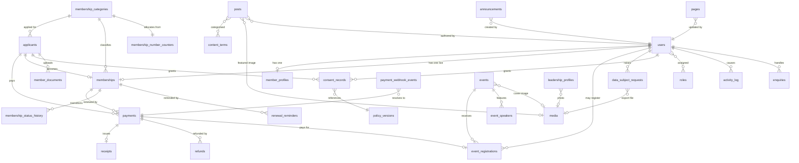

# ALDAPCON Platform — Backend Schema (V1)

**Product:** ALDAPCON — Association of Data Protection Compliance Organizations of Nigeria
**Document:** 05-backend-schema.md
**Companion to:** 01-prd.md, 02-trd.md, 03-app-flow.md (all approved)
**Database:** PostgreSQL 16 (TRD §2.2)
**Framework:** Laravel 12 (TRD §2.1)
**Version:** 1.1
**Status:** Approved, corrected per `08-spec-audit.md`

> **v1.1 incorporates** change set 01 and audit corrections **BC-2** (constraint violation in the activation transaction), BC-3, BC-4, BC-5, IG-3, IG-4, IG-13, N-3.

> Every table below traces to a numbered requirement in Section 7. Nothing here supports a feature the PRD excluded — there is no certificates table, no chapters, no votes, no courses, no jobs.

---

## 1. Data Overview

### 1.1 What this database is for

Four things, in order of how much damage a bug in each would do.

**It records money.** Every naira that moves must be traceable to a person, a purpose and a Paystack reference, and must remain reconcilable a year later. Payment records are effectively append-only; corrections are new rows, never edits.

**It records membership.** Who belongs, in what category, in good standing until when. This is the association's actual product. Membership numbers must be unique and never reused, and status must be derivable from data rather than remembered by an admin.

**It records consent and access.** For an association of compliance organisations, the audit trail is not overhead — it is the thing that makes the association credible. Who consented to what, under which version of which policy, and which administrator changed which record when.

**It stores content.** News, events, pages. The lowest-stakes part of the schema, and the part most likely to change.

### 1.2 The three structural decisions

**Applicants are separate from members.** The signup flow takes payment *before* registration (PRD FR-3.1), which means there is a real, persistent entity that has paid but is not yet a member. Modelling that as a half-written member row would put invalid members in the members table. `applicants` exists so that the "paid, awaiting registration" state (FR-3.8, App Flow D-04) is a first-class thing with its own lifecycle, not an absence.

**Money is stored in kobo as `BIGINT`.** No floats, no `NUMERIC` with rounding ambiguity, no naira decimals. `2500000` is ₦25,000. Every amount column is suffixed `_kobo` so the unit is impossible to misread at a call site.

**Payments never point at the current price.** `payments.amount_kobo` is the amount actually charged, snapshotted at the time. Changing a category fee (FR-2.2) must not retroactively alter a receipt (AC-F2), so the fee lives in two places on purpose: the current price on the category, the historical price on the payment.

### 1.3 Identifier strategy

Every table has a `BIGINT GENERATED ALWAYS AS IDENTITY` primary key for internal joins. Tables whose rows appear in URLs or emails additionally carry a `uuid` column with a unique index — `applicants`, `memberships`, `payments`, `events`, `event_registrations`, `data_subject_requests`.

Reason: sequential integers in public URLs leak volume ("you are member 14") and invite enumeration. UUIDs in every foreign key would bloat indexes for no benefit. Both, used for their respective jobs, costs one extra column on six tables.

### 1.4 Timestamps

All timestamps are `TIMESTAMPTZ`, stored in UTC, rendered in Africa/Lagos. Membership expiry is the exception worth naming: `expires_at` is a `TIMESTAMPTZ` set to end-of-day Lagos time, because "expires on 14 March" must not mean "expired at 1am on the 14th" for a member in Lagos.

---

## 2. Schema

Notation: `PK` primary key, `FK` foreign key, `UQ` unique, `IX` index, `NN` not null.

### 2.1 Authentication and identity

#### `users`

The authentication identity. Every member has one; not every user is a member (admins, publishers).

| Column | Type | Constraints | Notes |
|---|---|---|---|
| `id` | `BIGINT` | PK, identity | |
| `uuid` | `UUID` | NN, UQ, default `gen_random_uuid()` | |
| `full_name` | `VARCHAR(180)` | NN | Member-locked; admin-editable only (FR-5.2) |
| `email` | `CITEXT` | NN, UQ | Case-insensitive. Login identifier (FR-4.1) |
| `phone` | `VARCHAR(20)` | NN | Normalised to `+234…` on save |
| `password` | `VARCHAR(255)` | NN | bcrypt |
| `email_verified_at` | `TIMESTAMPTZ` | NULL | FR-4.2 |
| `two_factor_secret` | `TEXT` | NULL | Encrypted at rest |
| `two_factor_recovery_codes` | `TEXT` | NULL | Encrypted at rest |
| `two_factor_confirmed_at` | `TIMESTAMPTZ` | NULL | Mandatory for staff (FR-4.3) |
| `remember_token` | `VARCHAR(100)` | NULL | |
| `is_active` | `BOOLEAN` | NN, default `true` | Deactivated accounts cannot log in |
| `last_login_at` | `TIMESTAMPTZ` | NULL | |
| `last_login_ip` | `INET` | NULL | Security only. 90-day retention (§6.4) |
| `created_at` / `updated_at` | `TIMESTAMPTZ` | NN | |
| `deleted_at` | `TIMESTAMPTZ` | NULL | Soft delete (FR-9.4) |

**Indexes:** `UQ(email)`, `UQ(uuid)`, `IX(is_active)`, `IX(deleted_at)`.
**Validation:** email RFC-valid, ≤180 chars; phone matches Nigerian formats and normalises; password minimum 12 characters, checked against a compromised-password list.
**Constraint:** `CHECK (two_factor_confirmed_at IS NULL OR two_factor_secret IS NOT NULL)`.

#### `password_reset_tokens`

Laravel standard. `email` PK, `token` (hashed) NN, `created_at` NN. Single-use, expiring (AC-F4). Rows deleted on use.

#### `login_attempts`

Supports the lockout in FR-4.5 / AC-F4 and gives a security audit trail that a Redis counter cannot.

| Column | Type | Constraints |
|---|---|---|
| `id` | `BIGINT` | PK, identity |
| `email` | `CITEXT` | NN |
| `ip_address` | `INET` | NN |
| `successful` | `BOOLEAN` | NN |
| `user_agent` | `VARCHAR(400)` | NULL |
| `attempted_at` | `TIMESTAMPTZ` | NN, default `now()` |

**Indexes:** `IX(email, attempted_at DESC)`, `IX(ip_address, attempted_at DESC)`.
**Retention:** 90 days, pruned by scheduled job.
**Note:** the live throttle uses the Redis rate limiter for speed; this table is the durable record. Both must agree on the six-attempt threshold.

> **Sessions are in Redis (TRD §2.3), so there is no `sessions` table.** This means App Flow M-11 ("view and revoke active sessions") cannot be built without adding a session index table. M-11 is a derived screen (App Flow G-5) and is not approved. See §8, Q2.

### 2.2 Roles and permissions

Standard `spatie/laravel-permission` tables: `roles`, `permissions`, `model_has_roles`, `model_has_permissions`, `role_has_permissions`.

**Roles (FR-9.7):** `super_admin`, `admin`, `publisher`, `member`.

`roles`: `id` PK, `name` NN, `guard_name` NN, `UQ(name, guard_name)`.
`permissions`: same shape.
`model_has_roles`: `role_id` FK, `model_type`, `model_id`, composite PK, `IX(model_id, model_type)`.

**Permission set** (verb.resource):

```
members.view          members.update       members.deactivate
members.delete        members.export
payments.view         payments.export      payments.reverify
refunds.record
applicants.view       applicants.resend
categories.manage
events.manage         events.attendees.view
content.manage                              ← posts, pages, leadership, FAQ
announcements.manage
enquiries.view        subscribers.view
data_requests.manage
users.manage          audit.view           settings.manage
verifications.view    verifications.decide documents.view
```

| Role | Grants |
|---|---|
| `super_admin` | All |
| `admin` | All except `users.manage`, `audit.view`, `settings.manage`, `members.delete`. **Includes all three verification permissions** |
| `publisher` | `content.manage`, `events.manage` only |
| `member` | No admin permissions; portal access is by ownership, not permission |

**Rationale.** A publisher must not reach member, payment or **certificate** data even by direct URL (AC-F9), so their permission set contains nothing that touches those tables. `members.delete` is Super Admin only because deletion interacts with financial retention (§6.3).

### 2.3 Membership

#### `membership_categories`

| Column | Type | Constraints | Notes |
|---|---|---|---|
| `id` | `BIGINT` | PK, identity | |
| `name` | `VARCHAR(120)` | NN, UQ | |
| `slug` | `VARCHAR(140)` | NN, UQ | Used in `/join/{category}` |
| `applicant_type` | `applicant_type` enum | NN | `individual` \| `organisation` |
| `eligibility` | `TEXT` | NN | FR-2.1 |
| `benefits` | `JSONB` | NN, default `'[]'` | Ordered list of strings |
| `annual_fee_kobo` | `BIGINT` | NN, `CHECK >= 0` | FR-2.1 |
| `currency` | `CHAR(3)` | NN, default `'NGN'` | |
| `requires_verification` | `BOOLEAN` | NN, default `false` | When true: licence number required, certificate upload required, and administrator approval required before a membership is created (FR-2.1, FR-3.13) |
| `is_active` | `BOOLEAN` | NN, default `true` | Deactivating hides from join flow, keeps members (AC-F2) |
| `number_prefix` | `VARCHAR(12)` | NN | e.g. `DPO`, `DPCO` — feeds membership numbers |
| `sort_order` | `SMALLINT` | NN, default `0` | |
| `created_at` / `updated_at` | `TIMESTAMPTZ` | NN | |

**Indexes:** `UQ(slug)`, `UQ(name)`, `IX(is_active, sort_order)`, `UQ(number_prefix)`.

#### `membership_number_counters`

Makes FR-3.11 (unique, sequential per category, never reused) provable under concurrency. One row per category, locked with `SELECT … FOR UPDATE` inside the activation transaction.

| Column | Type | Constraints |
|---|---|---|
| `category_id` | `BIGINT` | PK, FK → `membership_categories.id` |
| `last_number` | `INTEGER` | NN, default `0`, `CHECK >= 0` |
| `updated_at` | `TIMESTAMPTZ` | NN |

Number format: `{prefix}-{year}-{number padded to 5}` → `DPCO-2026-00034`.

> Application-level `MAX(number) + 1` fails the concurrent-activation case in AC-F3 and will eventually issue duplicates. This table, or a Postgres sequence per category, is not optional. A counter table is preferred over dynamic sequences because creating a category should not require DDL.

#### `applicants`

The paid-but-not-yet-member entity (FR-3.2, FR-3.8).

| Column | Type | Constraints | Notes |
|---|---|---|---|
| `id` | `BIGINT` | PK, identity | |
| `uuid` | `UUID` | NN, UQ | Not used in the registration link — see below |
| `category_id` | `BIGINT` | NN, FK → `membership_categories.id`, `ON DELETE RESTRICT` | |
| `full_name` | `VARCHAR(180)` | NN | |
| `email` | `CITEXT` | NN | |
| `phone` | `VARCHAR(20)` | NN | |
| `status` | `applicant_status` enum | NN, default `'initiated'` | `initiated` \| `paid` \| `pending_verification` \| `registered` \| `rejected` \| `abandoned` \| `refunded` |
| `fee_kobo_at_initiation` | `BIGINT` | NN | The amount quoted; payment holds the amount charged |
| `registration_token_hash` | `VARCHAR(64)` | NULL, UQ | SHA-256 of the signed link token |
| `token_expires_at` | `TIMESTAMPTZ` | NULL | See G-3 / Q3 |
| `token_issued_count` | `SMALLINT` | NN, default `0` | Rate-limits resends (App Flow J-09) |
| `paid_at` | `TIMESTAMPTZ` | NULL | |
| `registered_at` | `TIMESTAMPTZ` | NULL | |
| `membership_id` | `BIGINT` | NULL, FK → `memberships.id`, `ON DELETE SET NULL` | Set at activation |
| `user_id` | `BIGINT` | NULL, FK → `users.id`, `ON DELETE SET NULL` | The account exists before the membership does on the verification path |
| `submitted_at` | `TIMESTAMPTZ` | NULL | When submitted for review |
| `reviewed_at` | `TIMESTAMPTZ` | NULL | |
| `reviewed_by_user_id` | `BIGINT` | NULL, FK → `users.id` | |
| `review_decision` | `review_decision` enum | NULL | `approved` \| `rejected` \| `correction_requested` |
| `review_reason` | `VARCHAR(500)` | NULL | **NN in application when the decision is `rejected` or `correction_requested`** |
| `correction_requested_count` | `SMALLINT` | NN, default `0` | |
| `created_at` / `updated_at` | `TIMESTAMPTZ` | NN | |

**Indexes:** `UQ(uuid)`, `UQ(registration_token_hash)`, `IX(status, paid_at)` — drives the D-04 queue, `IX(email)`, `IX(category_id)`.
**Constraints:**
- `CHECK (status <> 'paid' OR paid_at IS NOT NULL)`
- `CHECK (status <> 'registered' OR (registered_at IS NOT NULL AND membership_id IS NOT NULL))`
- **Partial unique:** `UNIQUE (email) WHERE status IN ('initiated','paid','pending_verification')` — prevents a second in-flight application on the same address (App Flow J-02 edge case).
- `CHECK (status <> 'pending_verification' OR submitted_at IS NOT NULL)`
- `CHECK (status <> 'rejected' OR (reviewed_at IS NOT NULL AND review_reason IS NOT NULL))`
- `CHECK (status NOT IN ('pending_verification','registered','rejected') OR user_id IS NOT NULL)`

**Additional index:** `IX(status, submitted_at)` — drives the D-22 verification queue, oldest first.

> **`membership_status` is unchanged.** A pending applicant has **no membership row at all**. Keeping them out of `memberships` preserves `membership_number NOT NULL`, leaves every dashboard count and the one-live-membership-per-user constraint untouched, and means `memberships` contains only real members.

**The token is stored hashed, never in plaintext.** The plaintext lives only in the email. A leaked database backup must not hand somebody the ability to complete another person's registration and set its password.

#### `memberships`

| Column | Type | Constraints | Notes |
|---|---|---|---|
| `id` | `BIGINT` | PK, identity | |
| `uuid` | `UUID` | NN, UQ | |
| `user_id` | `BIGINT` | NN, FK → `users.id`, `ON DELETE RESTRICT` | |
| `category_id` | `BIGINT` | NN, FK → `membership_categories.id`, `ON DELETE RESTRICT` | |
| `membership_number` | `VARCHAR(30)` | NN, UQ | FR-3.11 |
| `status` | `membership_status` enum | NN, default `'active'` | `active` \| `expiring_soon` \| `expired` \| `suspended` |
| `joined_at` | `TIMESTAMPTZ` | NN | |
| `expires_at` | `TIMESTAMPTZ` | NN | End of day, Africa/Lagos |
| `last_renewed_at` | `TIMESTAMPTZ` | NULL | |
| `created_at` / `updated_at` | `TIMESTAMPTZ` | NN | |
| `deleted_at` | `TIMESTAMPTZ` | NULL | |

**Indexes:** `UQ(membership_number)`, `UQ(uuid)`, `IX(status, expires_at)` — drives the daily lifecycle job and the D-01 dashboard counts, `IX(category_id, status)`, `IX(user_id)`.
**Constraints:**
- **`UNIQUE (user_id) WHERE deleted_at IS NULL`** — one live membership per user. This is the database-level half of FR-3.10.
- `CHECK (expires_at > joined_at)`

> **G-1 (App Flow):** FR-3.10 forbids a duplicate active membership but does not say where the check runs. The application must check **at J-02, before Paystack is called**, or a person can pay and then be refused. The constraint above is the safety net, not the user-facing control — hitting it means the application already failed and somebody has paid for nothing.

#### `member_profiles`

One-to-one with `users`. Holds the FR-3.6 registration fields. Separate from `users` because these are member attributes, not authentication attributes, and admin and publisher accounts have none of them.

| Column | Type | Constraints |
|---|---|---|
| `user_id` | `BIGINT` | PK, FK → `users.id`, `ON DELETE CASCADE` |
| `organisation` | `VARCHAR(200)` | NULL |
| `job_title` | `VARCHAR(150)` | NULL |
| `qualifications` | `TEXT` | NULL |
| `ndpc_licence_number` | `VARCHAR(60)` | NULL |
| `state` | `VARCHAR(60)` | NN |
| `city` | `VARCHAR(80)` | NN |
| `referral_source` | `VARCHAR(120)` | NULL |
| `created_at` / `updated_at` | `TIMESTAMPTZ` | NN |

**Indexes:** `IX(organisation)` for admin search (FR-9.2), `IX(ndpc_licence_number)`.
**Validation:** `ndpc_licence_number` required when the category has `requires_verification = true` — enforced in application validation, since the rule spans two tables.

> There is **no verification column** on the licence number. PRD **Q3** is unanswered. If verification is approved, this table gains `licence_verified_at` and `licence_verified_by`, and `memberships.status` gains a `pending_verification` value — a change that touches the lifecycle job, the dashboard, the portal and the join flow. See §8.

#### `member_documents`

NDPC certificates uploaded for verification (FR-3.6, FR-3.13). **Deliberately not stored in `media`** — that table is built for publicly served content images and requires `alt_text NOT NULL`, which is meaningless for a licence certificate. Private documents need different access rules, different retention and integrity hashing.

| Column | Type | Constraints |
|---|---|---|
| `id` | `BIGINT` | PK, identity |
| `uuid` | `UUID` | NN, UQ |
| `applicant_id` | `BIGINT` | NN, FK → `applicants.id`, `ON DELETE RESTRICT` |
| `user_id` | `BIGINT` | NULL, FK → `users.id`, `ON DELETE SET NULL` |
| `type` | `document_type` enum | NN — `ndpc_certificate` |
| `disk` | `VARCHAR(30)` | NN, default `'private'` |
| `path` | `VARCHAR(400)` | NN, UQ |
| `original_filename` | `VARCHAR(255)` | NN |
| `mime_type` | `VARCHAR(100)` | NN |
| `size_bytes` | `BIGINT` | NN, `CHECK > 0` |
| `sha256` | `CHAR(64)` | NN |
| `superseded_by_id` | `BIGINT` | NULL, FK → `member_documents.id` |
| `uploaded_at` | `TIMESTAMPTZ` | NN, default `now()` |
| `deleted_at` | `TIMESTAMPTZ` | NULL |

**Indexes:** `UQ(uuid)`, `UQ(path)`, `IX(applicant_id, type)`, `IX(deleted_at)`.
**Constraint:** `CHECK (mime_type IN ('application/pdf','image/jpeg','image/png'))`.

`sha256` lets an administrator confirm the document reviewed is the document stored — worth one column for a body whose entire product is verification. `superseded_by_id` preserves the original when a correction is uploaded.

**Storage path:** `storage/app/private/certificates/{applicant_uuid}/{document_uuid}.{ext}` — never under `public/`, never symlinked, always streamed through D-24 after a policy check.

#### `membership_status_history`

Append-only record of every transition, whether by the scheduler or an admin. Required to prove AC-F6 and to make expiry overrides accountable (FR-6.6).

| Column | Type | Constraints |
|---|---|---|
| `id` | `BIGINT` | PK, identity |
| `membership_id` | `BIGINT` | NN, FK → `memberships.id`, `ON DELETE CASCADE` |
| `from_status` | `membership_status` | NULL |
| `to_status` | `membership_status` | NN |
| `from_expires_at` | `TIMESTAMPTZ` | NULL |
| `to_expires_at` | `TIMESTAMPTZ` | NULL |
| `reason` | `VARCHAR(400)` | NULL — **NN in application when `changed_by_user_id` is set** |
| `changed_by_user_id` | `BIGINT` | NULL, FK → `users.id` — null means the system scheduler |
| `created_at` | `TIMESTAMPTZ` | NN, default `now()` |

**Indexes:** `IX(membership_id, created_at DESC)`.

#### `renewal_reminders`

Guarantees each reminder fires exactly once per cycle (FR-6.3, AC-F6).

| Column | Type | Constraints |
|---|---|---|
| `id` | `BIGINT` | PK, identity |
| `membership_id` | `BIGINT` | NN, FK → `memberships.id`, `ON DELETE CASCADE` |
| `cycle_expires_at` | `TIMESTAMPTZ` | NN |
| `stage` | `reminder_stage` enum | NN — `t_minus_30` \| `t_minus_7` \| `t_minus_1` \| `t_plus_1` |
| `sent_at` | `TIMESTAMPTZ` | NN, default `now()` |

**Constraint:** `UNIQUE (membership_id, cycle_expires_at, stage)`.

> `cycle_expires_at` is in the key deliberately. Keying on `(membership_id, stage)` alone would send the 30-day reminder once in the member's lifetime and never again after their first renewal — a bug that would not surface until year two.

### 2.4 Payments

#### `payments`

| Column | Type | Constraints | Notes |
|---|---|---|---|
| `id` | `BIGINT` | PK, identity | |
| `uuid` | `UUID` | NN, UQ | |
| `purpose` | `payment_purpose` enum | NN | `membership_registration` \| `membership_renewal` \| `event_registration` |
| `status` | `payment_status` enum | NN, default `'pending'` | `pending` \| `success` \| `failed` \| `abandoned` \| `refunded` |
| `amount_kobo` | `BIGINT` | NN, `CHECK > 0` | Amount charged, snapshotted (AC-F2) |
| `currency` | `CHAR(3)` | NN, default `'NGN'` | |
| `gateway_fee_kobo` | `BIGINT` | NULL | From Paystack, for reconciliation |
| `paystack_reference` | `VARCHAR(100)` | NN, UQ | |
| `paystack_access_code` | `VARCHAR(100)` | NULL | |
| `channel` | `VARCHAR(30)` | NULL | card / bank / ussd, as reported |
| `payer_name` | `VARCHAR(180)` | NN | Snapshot — payer may differ from member |
| `payer_email` | `CITEXT` | NN | |
| `applicant_id` | `BIGINT` | NULL, FK → `applicants.id`, `ON DELETE RESTRICT` | |
| `membership_id` | `BIGINT` | NULL, FK → `memberships.id`, `ON DELETE RESTRICT` | |
| `event_registration_id` | `BIGINT` | NULL, FK → `event_registrations.id`, `ON DELETE RESTRICT` | **Migration order (audit BC-4):** `events` and `event_registrations` must be created in Phase 8 alongside `payments`, not Phase 12, or this foreign key references a table that does not yet exist and the migration fails. The event *interface* stays in Phase 12; only the tables move earlier |
| `verified_payload` | `JSONB` | NULL | Response from Verify Transaction |
| `initiated_at` | `TIMESTAMPTZ` | NN, default `now()` | |
| `paid_at` | `TIMESTAMPTZ` | NULL | |
| `failed_reason` | `VARCHAR(300)` | NULL | |
| `created_at` / `updated_at` | `TIMESTAMPTZ` | NN | |

**Indexes:** `UQ(paystack_reference)`, `UQ(uuid)`, `IX(status, initiated_at DESC)`, `IX(purpose, paid_at DESC)` — drives dashboard revenue, `IX(payer_email)`, `IX(applicant_id)`, `IX(membership_id)`, `IX(event_registration_id)`.
**Constraints:**
- Exactly one target: `CHECK (num_nonnulls(applicant_id, membership_id, event_registration_id) = 1)` — **and it stays exactly one for the life of the row.** A registration payment is never re-pointed at the membership it eventually produced; see the note under §4.3 (audit BC-2)
- `CHECK (status <> 'success' OR paid_at IS NOT NULL)`

**Explicit nullable FKs are used instead of a polymorphic `payable_type`/`payable_id` pair.** Polymorphic keys cannot be enforced by the database, and this is the money table. Referential integrity on financial records is worth three nullable columns.

**Row creation (audit BC-3).** The `payments` row is created **at Paystack Initialize**, with `status = 'pending'`, before the applicant leaves for the hosted checkout. This is what makes FR-3.9 satisfiable: failed and abandoned attempts are visible in D-05 rather than leaving no trace. A scheduled sweep (FR-3.14) moves rows that remain `pending` beyond a configured interval to `abandoned`.

> **Naming caution.** `payments.status = 'abandoned'` means a transaction never completed. `applicants.status = 'abandoned'` means a person never registered. They are different events and can occur independently — do not treat one as implying the other.

**Update policy.** `payments` is treated as append-only in application code. The only permitted transitions are `pending → success`, `pending → failed`, `pending → abandoned`, and `success → refunded`. No other column is ever updated after `paid_at` is set. Corrections are new rows in `refunds`.

#### `payment_webhook_events`

Makes webhook idempotency provable (AC-F3, TRD §8 Tier 1).

| Column | Type | Constraints |
|---|---|---|
| `id` | `BIGINT` | PK, identity |
| `event_type` | `VARCHAR(60)` | NN |
| `paystack_reference` | `VARCHAR(100)` | NULL |
| `payment_id` | `BIGINT` | NULL, FK → `payments.id`, `ON DELETE SET NULL` |
| `idempotency_key` | `VARCHAR(128)` | NN, **UQ** |
| `signature_valid` | `BOOLEAN` | NN |
| `raw_payload` | `JSONB` | NN |
| `processing_status` | `webhook_status` enum | NN, default `'received'` — `received` \| `processed` \| `ignored` \| `failed` |
| `processing_error` | `TEXT` | NULL |
| `received_at` | `TIMESTAMPTZ` | NN, default `now()` |
| `processed_at` | `TIMESTAMPTZ` | NULL |

**Indexes:** `UQ(idempotency_key)`, `IX(paystack_reference)`, `IX(processing_status, received_at)`.
`idempotency_key` = SHA-256 of `event_type` + reference + Paystack's event identifier. **The unique constraint is the idempotency guarantee** — a duplicate delivery fails to insert and is acknowledged without reprocessing. Application-level "have I seen this?" checks race under concurrent delivery.
**Retention:** `raw_payload` nulled after 180 days; the row itself retained for 7 years (§6.4).

#### `receipts`

| Column | Type | Constraints |
|---|---|---|
| `id` | `BIGINT` | PK, identity |
| `payment_id` | `BIGINT` | NN, UQ, FK → `payments.id`, `ON DELETE RESTRICT` |
| `receipt_number` | `VARCHAR(30)` | NN, UQ |
| `snapshot` | `JSONB` | NN |
| `issued_at` | `TIMESTAMPTZ` | NN, default `now()` |

`snapshot` freezes association details, payer details, amount, purpose and date at issue. Receipts are regenerated as PDF on demand (App Flow M-04) but never recomputed from live data — an admin correcting a member's organisation must not silently alter a receipt issued last year.
**Never updated. Never deleted.**

#### `refunds`

Refunds are executed in Paystack and recorded here (PRD A11). Needed for App Flow G-8 (event oversell) and Q4.

| Column | Type | Constraints |
|---|---|---|
| `id` | `BIGINT` | PK, identity |
| `payment_id` | `BIGINT` | NN, FK → `payments.id`, `ON DELETE RESTRICT` |
| `amount_kobo` | `BIGINT` | NN, `CHECK > 0` |
| `reason` | `VARCHAR(400)` | NN |
| `paystack_reference` | `VARCHAR(100)` | NULL |
| `recorded_by_user_id` | `BIGINT` | NN, FK → `users.id` |
| `refunded_at` | `TIMESTAMPTZ` | NN |
| `created_at` | `TIMESTAMPTZ` | NN |

**Constraint:** application-enforced — total refunds against a payment may not exceed `payments.amount_kobo`.

### 2.5 Events

#### `events`

| Column | Type | Constraints | Notes |
|---|---|---|---|
| `id` | `BIGINT` | PK, identity | |
| `uuid` | `UUID` | NN, UQ | |
| `title` | `VARCHAR(200)` | NN | |
| `slug` | `VARCHAR(220)` | NN, UQ | |
| `description` | `TEXT` | NN | Sanitised HTML |
| `starts_at` | `TIMESTAMPTZ` | NN | |
| `ends_at` | `TIMESTAMPTZ` | NN | |
| `location_type` | `event_location_type` enum | NN | `physical` \| `virtual` \| `hybrid` |
| `location` | `VARCHAR(300)` | NULL | |
| `virtual_link` | `VARCHAR(500)` | NULL | Released only to confirmed registrants |
| `cover_media_id` | `BIGINT` | NULL, FK → `media.id`, `ON DELETE SET NULL` | |
| `capacity` | `INTEGER` | NULL, `CHECK > 0` | Null = unlimited |
| `confirmed_count` | `INTEGER` | NN, default `0`, `CHECK >= 0` | Denormalised counter — see §4.5 |
| `member_price_kobo` | `BIGINT` | NN, default `0`, `CHECK >= 0` | FR-8.2 |
| `non_member_price_kobo` | `BIGINT` | NN, default `0`, `CHECK >= 0` | |
| `status` | `publication_status` enum | NN, default `'draft'` | `draft` \| `published`. **Events do not share `content_status`** — FR-7.2 grants scheduled publishing to posts only, and no requirement gives events a scheduled state. Leaving an unreachable value in a shared enum invites somebody to implement it later with no requirement behind it (audit IG-4) |
| `published_at` | `TIMESTAMPTZ` | NULL | |
| `created_by_user_id` | `BIGINT` | NN, FK → `users.id` | |
| `created_at` / `updated_at` | `TIMESTAMPTZ` | NN | |
| `deleted_at` | `TIMESTAMPTZ` | NULL | |

**Indexes:** `UQ(slug)`, `UQ(uuid)`, `IX(status, starts_at)`, `IX(starts_at)`.
**Constraints:** `CHECK (ends_at > starts_at)`; `CHECK (location_type = 'virtual' OR location IS NOT NULL)`; `CHECK (capacity IS NULL OR confirmed_count <= capacity)`.

> That last constraint is what makes overselling a database error rather than a silent business error. It converts App Flow G-8 from an invisible failure into an alert.

#### `event_speakers`

| Column | Type | Constraints |
|---|---|---|
| `id` | `BIGINT` | PK, identity |
| `event_id` | `BIGINT` | NN, FK → `events.id`, `ON DELETE CASCADE` |
| `name` | `VARCHAR(150)` | NN |
| `title` | `VARCHAR(150)` | NULL |
| `organisation` | `VARCHAR(150)` | NULL |
| `photo_media_id` | `BIGINT` | NULL, FK → `media.id`, `ON DELETE SET NULL` |
| `sort_order` | `SMALLINT` | NN, default `0` |

**Index:** `IX(event_id, sort_order)`.

#### `event_registrations`

| Column | Type | Constraints | Notes |
|---|---|---|---|
| `id` | `BIGINT` | PK, identity | |
| `uuid` | `UUID` | NN, UQ | |
| `event_id` | `BIGINT` | NN, FK → `events.id`, `ON DELETE RESTRICT` | |
| `user_id` | `BIGINT` | NULL, FK → `users.id`, `ON DELETE SET NULL` | Null for visitors (FR-8.4) |
| `name` | `VARCHAR(180)` | NN | Snapshot |
| `email` | `CITEXT` | NN | |
| `phone` | `VARCHAR(20)` | NN | |
| `price_type` | `event_price_type` enum | NN | `member` \| `non_member` \| `free` |
| `price_kobo` | `BIGINT` | NN, `CHECK >= 0` | Snapshot |
| `status` | `registration_status` enum | NN, default `'pending_payment'` | `pending_payment` \| `confirmed` \| `cancelled` |
| `confirmed_at` | `TIMESTAMPTZ` | NULL | |
| `created_at` / `updated_at` | `TIMESTAMPTZ` | NN | |

**Indexes:** `UQ(uuid)`, `IX(event_id, status)`, `IX(email)`, `IX(user_id)`.
**Constraint:** `UNIQUE (event_id, email) WHERE status = 'confirmed'` — one confirmed seat per address per event.

> Registration is retained for people who are not members and never had an account (FR-8.4). This is personal data held with no user record behind it, which makes the retention rule in §6.4 mandatory rather than tidy.

### 2.6 Content

#### `posts`

| Column | Type | Constraints |
|---|---|---|
| `id` | `BIGINT` | PK, identity |
| `title` | `VARCHAR(220)` | NN |
| `slug` | `VARCHAR(240)` | NN, UQ |
| `excerpt` | `VARCHAR(400)` | NULL |
| `body` | `TEXT` | NN |
| `featured_media_id` | `BIGINT` | NULL, FK → `media.id`, `ON DELETE SET NULL` |
| `author_user_id` | `BIGINT` | NN, FK → `users.id`, `ON DELETE RESTRICT` |
| `status` | `content_status` enum | NN, default `'draft'` |
| `published_at` | `TIMESTAMPTZ` | NULL |
| `meta_title` | `VARCHAR(200)` | NULL |
| `meta_description` | `VARCHAR(320)` | NULL |
| `search_vector` | `TSVECTOR` | NULL, generated |
| `created_at` / `updated_at` | `TIMESTAMPTZ` | NN |
| `deleted_at` | `TIMESTAMPTZ` | NULL |

**Indexes:** `UQ(slug)`, `IX(status, published_at DESC)`, **GIN**`(search_vector)` for FR-1.6, `IX(author_user_id)`.
**Constraint:** `CHECK (status <> 'published' OR published_at IS NOT NULL)`.
**Scheduling:** `status = 'scheduled'` with a future `published_at`; the publish job flips it. Public queries filter `status = 'published' AND published_at <= now()` — belt and braces, so a stuck job cannot leak a scheduled post early, and a draft URL 404s (AC-F7).

#### `slug_redirects`

Required by App Flow P-06: a changed slug must 301, or every shared link breaks.

| Column | Type | Constraints |
|---|---|---|
| `id` | `BIGINT` | PK, identity |
| `entity_type` | `VARCHAR(30)` | NN — `post` \| `event` \| `page` |
| `old_slug` | `VARCHAR(240)` | NN |
| `entity_id` | `BIGINT` | NN |
| `created_at` | `TIMESTAMPTZ` | NN |

**Constraint:** `UNIQUE (entity_type, old_slug)`.

#### `content_terms` and `post_term`

Many-to-many for post categories and tags (FR-7.1, FR-7.3).

`content_terms`: `id` PK, `type` enum (`category` \| `tag`) NN, `name` NN, `slug` NN, `UQ(type, slug)`.
`post_term`: `post_id` FK, `term_id` FK, composite PK, `IX(term_id)`.

#### `pages`

`id` PK, `title` NN, `slug` NN UQ, `body` TEXT NN, `meta_title`, `meta_description`, `is_system` BOOLEAN NN default false, `search_vector` TSVECTOR (GIN), `updated_by_user_id` FK, timestamps.
`is_system = true` for About, Contact and the legal pages — deletable by nobody, since the navigation and signup flow link to them by slug.

#### `leadership_profiles`

`id` PK, `name` NN, `position` NN, `bio` TEXT, `photo_media_id` FK nullable, `sort_order` SMALLINT NN, `is_published` BOOLEAN NN default true, timestamps. `IX(is_published, sort_order)`. (FR-1.3)

#### `faqs`

`id` PK, `question` NN, `answer` TEXT NN, `group` VARCHAR(80) NULL, `sort_order` SMALLINT NN, `is_published` BOOLEAN NN default true, `search_vector` TSVECTOR (GIN), timestamps.

#### `announcements`

Member-facing announcements (FR-5.5).

`id` PK, `title` NN, `body` TEXT NN, `published_at` TIMESTAMPTZ NULL, `status` content_status NN default draft, `created_by_user_id` FK, timestamps, `deleted_at`. `IX(status, published_at DESC)`.

> **This table exists because of App Flow G-6.** FR-5.5 gives members announcements but no PRD requirement says who creates them. Without this table and the D-15 screen, FR-5.5 is unimplementable. Flagged, not assumed.

#### `media`

| Column | Type | Constraints |
|---|---|---|
| `id` | `BIGINT` | PK, identity |
| `uuid` | `UUID` | NN, UQ |
| `disk` | `VARCHAR(30)` | NN, default `'local'` |
| `path` | `VARCHAR(400)` | NN, UQ |
| `original_filename` | `VARCHAR(255)` | NN |
| `mime_type` | `VARCHAR(100)` | NN |
| `size_bytes` | `BIGINT` | NN |
| `width` / `height` | `INTEGER` | NULL |
| `alt_text` | `VARCHAR(300)` | **NN** |
| `uploaded_by_user_id` | `BIGINT` | NN, FK → `users.id` |
| `created_at` | `TIMESTAMPTZ` | NN |

**`alt_text` is `NOT NULL` at the database level.** PRD NFR 6.5 requires alt text as a validation rule; enforcing it in the schema means no code path can bypass it.

### 2.7 Communications and enquiries

#### `newsletter_subscribers`

| Column | Type | Constraints |
|---|---|---|
| `id` | `BIGINT` | PK, identity |
| `email` | `CITEXT` | NN, UQ |
| `status` | `subscriber_status` enum | NN, default `'pending'` — `pending` \| `confirmed` \| `unsubscribed` |
| `confirmation_token_hash` | `VARCHAR(64)` | NULL, UQ |
| `confirmed_at` | `TIMESTAMPTZ` | NULL |
| `unsubscribed_at` | `TIMESTAMPTZ` | NULL |
| `consent_policy_version` | `VARCHAR(20)` | NN |
| `consent_ip` | `INET` | NULL |
| `created_at` / `updated_at` | `TIMESTAMPTZ` | NN |

Double opt-in per AC-F7. `IX(status)`.

#### `enquiries`

`id` PK, `name` NN, `email` CITEXT NN, `subject` VARCHAR(200) NN, `message` TEXT NN, `ip_address` INET NULL, `status` enum (`new`|`read`|`archived`) NN default new, `handled_by_user_id` FK nullable, timestamps. `IX(status, created_at DESC)`. (FR-11.2)

#### `email_log`

Supports FR-10.1 and the support question "did they get it?", which otherwise has no answer.

`id` PK, `to_email` CITEXT NN, `mailable` VARCHAR(120) NN, `subject` VARCHAR(250) NN, `related_type` VARCHAR(40) NULL, `related_id` BIGINT NULL, `status` enum (`queued`|`sent`|`failed`) NN, `provider_message_id` VARCHAR(150) NULL, `error` TEXT NULL, `sent_at` TIMESTAMPTZ NULL, `created_at` NN.
**Indexes:** `IX(to_email, created_at DESC)`, `IX(status)`.
**Body is never stored** — only metadata. Retention 12 months (§6.4).

### 2.8 Privacy and governance

#### `policy_versions`

Required so a consent record points at a policy somebody can still read (App Flow P-12 edge case).

`id` PK, `slug` VARCHAR(40) NN (`privacy-policy` | `cookie-policy` | `terms`), `version` VARCHAR(20) NN, `body` TEXT NN, `effective_from` TIMESTAMPTZ NN, `created_at` NN. `UNIQUE (slug, version)`, `IX(slug, effective_from DESC)`.
**Rows are never updated or deleted.** A new policy is a new row.

#### `consent_records`

Append-only (FR-12.2).

| Column | Type | Constraints |
|---|---|---|
| `id` | `BIGINT` | PK, identity |
| `user_id` | `BIGINT` | NULL, FK → `users.id`, `ON DELETE SET NULL` |
| `applicant_id` | `BIGINT` | NULL, FK → `applicants.id`, `ON DELETE SET NULL` |
| `email` | `CITEXT` | NN |
| `purpose` | `consent_purpose` enum | NN — `membership_processing` \| `marketing` \| `event_processing` |
| `granted` | `BOOLEAN` | NN |
| `policy_version_id` | `BIGINT` | NULL, FK → `policy_versions.id`, `ON DELETE RESTRICT` |
| `consent_text_snapshot` | `TEXT` | NN |
| `ip_address` | `INET` | NN |
| `user_agent` | `VARCHAR(400)` | NULL |
| `created_at` | `TIMESTAMPTZ` | NN, default `now()` |

**Indexes:** `IX(email, purpose, created_at DESC)`, `IX(user_id)`.
Withdrawal is a new row with `granted = false`. The current state is the latest row per `(email, purpose)`. **Never an update.**

> There is no `cookie_consents` table. Cookie choice (FR-12.1) is stored in a first-party cookie. Storing it server-side would require identifying an anonymous visitor — creating personal data in order to record a preference not to be tracked. The banner records the choice client-side; the audit evidence is the banner implementation and its policy version, not a per-visitor row.

#### `data_subject_requests`

| Column | Type | Constraints |
|---|---|---|
| `id` | `BIGINT` | PK, identity |
| `uuid` | `UUID` | NN, UQ |
| `user_id` | `BIGINT` | NN, FK → `users.id`, `ON DELETE RESTRICT` |
| `type` | `dsr_type` enum | NN — `export` \| `erasure` |
| `status` | `dsr_status` enum | NN, default `'pending'` — `pending` \| `in_progress` \| `fulfilled` \| `refused` |
| `requested_at` | `TIMESTAMPTZ` | NN |
| `fulfilled_at` | `TIMESTAMPTZ` | NULL |
| `fulfilled_by_user_id` | `BIGINT` | NULL, FK → `users.id` |
| `notes` | `TEXT` | NULL |
| `export_path` | `VARCHAR(400)` | NULL |
| `export_expires_at` | `TIMESTAMPTZ` | NULL |

`IX(status, requested_at)`. (FR-12.3)

> **Audit BC-5 — corrected.** An earlier draft pointed this at `media.id`. `media.alt_text` is `NOT NULL` by design, so a ZIP of somebody's exported personal data would either fail to store or force an operator to type filler into an accessibility field — on the one artefact in the system made entirely of personal data. `media` is also the table for publicly served content, while exports live under `private/`. A path and an expiry are all this needs; the file is transient and does not deserve a row.

#### `activity_log`

`spatie/laravel-activitylog` shape: `id` PK, `log_name`, `description` NN, `subject_type`/`subject_id`, `causer_type`/`causer_id`, `properties` JSONB, `batch_uuid`, `created_at` NN.
**Indexes:** `IX(subject_type, subject_id)`, `IX(causer_id, created_at DESC)`, `IX(log_name, created_at DESC)`.

**Append-only enforcement (FR-9.8, TRD §11.6).** The application database role is granted `INSERT` and `SELECT` on this table and explicitly **not** `UPDATE` or `DELETE`:

```sql
REVOKE UPDATE, DELETE ON activity_log FROM aldapcon_app;
GRANT INSERT, SELECT ON activity_log TO aldapcon_app;
```

Pruning is performed by a separate maintenance role. This is an approximation of immutability, not immutability — anyone with superuser access can still alter it, and in a solo-maintainer setup that is the same person the log exists to record. Calling it immutable in the privacy policy would be untrue.

#### `settings`

`key` VARCHAR(80) PK, `value` JSONB NN, `group` VARCHAR(40) NN, `updated_by_user_id` FK, `updated_at` NN. (D-21)

### 2.9 Framework tables

`migrations`, `jobs`, `job_batches`, `failed_jobs`, `cache`, `cache_locks`. Standard Laravel. Cache and sessions are in Redis, so the `cache` table exists only as a fallback. `failed_jobs` is operationally important: a failed activation job is a paid member with no membership, and it must alert rather than sit quietly.

---

## 3. Entity-Relationship Diagram



Relationship cardinality summary:

| Type | Instances |
|---|---|
| **One-to-one** | `users` ↔ `member_profiles`; `users` ↔ `memberships` (enforced by partial unique); `payments` ↔ `receipts`; `membership_categories` ↔ `membership_number_counters` |
| **One-to-many** | Category → applicants, memberships; membership → payments, status history, reminders; event → registrations, speakers; payment → refunds; user → activity log, consents, data requests |
| **Many-to-many** | `users` ↔ `roles` (via `model_has_roles`); `posts` ↔ `content_terms` (via `post_term`) |

---

## 4. Data Operations and Transaction Boundaries

### 4.1 Applicant creation (J-02)

```
BEGIN
  -- G-1: duplicate check BEFORE payment, not after
  SELECT 1 FROM memberships m
    JOIN users u ON u.id = m.user_id
   WHERE u.email = :email AND m.deleted_at IS NULL
     AND m.status <> 'expired'
  → if found: abort, no applicant, no Paystack call

  INSERT INTO applicants (…, status='initiated', fee_kobo_at_initiation)
  INSERT INTO consent_records (purpose='membership_processing', granted=true, …)
COMMIT
-- then, outside the transaction: call Paystack Initialize
```

Paystack is called **after** commit. An external HTTP call inside a transaction holds a lock for the duration of somebody else's network latency.

### 4.2 Webhook ingestion

```
BEGIN
  INSERT INTO payment_webhook_events (idempotency_key, …)
    ON CONFLICT (idempotency_key) DO NOTHING
  → 0 rows affected means duplicate delivery: COMMIT, return 200, do nothing
COMMIT
-- then dispatch a queued job to process it
```

Acknowledge fast, process asynchronously. Paystack retries on timeout, and a slow synchronous handler manufactures the duplicates the idempotency key then has to absorb.

### 4.3 Activation — the critical transaction (FR-3.7, AC-F3)

```
BEGIN
  SELECT * FROM applicants WHERE id = :id FOR UPDATE
  → abort if status <> 'paid'  (idempotency guard)

  SELECT * FROM membership_number_counters
    WHERE category_id = :cat FOR UPDATE          -- serialises allocation
  UPDATE membership_number_counters SET last_number = last_number + 1

  INSERT INTO users (…)
  INSERT INTO member_profiles (…)
  INSERT INTO memberships (membership_number, status='active',
                           joined_at=now(), expires_at=now()+12 months)
  INSERT INTO membership_status_history (to_status='active', …)
  INSERT INTO consent_records (…)
  UPDATE applicants SET status='registered', membership_id=…, registered_at=now()
COMMIT
-- then queue: welcome email, admin notification
```

All or nothing. A half-created member — user row without membership, or membership without a number — is worse than a clean failure the applicant can retry. **Emails are queued after commit**, never inside, or a rollback sends a welcome to somebody who has no account.

> **Audit BC-2 — corrected.** An earlier draft ended this transaction with `UPDATE payments SET membership_id = … WHERE applicant_id = :id`. That row already carries `applicant_id`, so setting `membership_id` would make two of the three target columns non-null, `num_nonnulls` would return 2, and the `CHECK … = 1` constraint below would fail — **rolling back every signup at the final commit**, after the money had been taken. The line is removed. A registration payment carries `applicant_id` permanently; the route to the membership is `payments → applicants.membership_id → memberships`. Only renewal payments carry `membership_id` directly.

### 4.3b Registration and approval on the verification path

**T3a — Registration (verifying category).** No membership, no membership number.

```
BEGIN
  SELECT * FROM applicants WHERE id = :id FOR UPDATE
  → abort unless status = 'paid'
  INSERT INTO users (…)
  INSERT INTO member_profiles (…)
  INSERT INTO member_documents (…)          -- file already on the private disk
  INSERT INTO consent_records (…)
  UPDATE applicants SET status='pending_verification',
                        submitted_at=now(), user_id=…
COMMIT
-- then queue: acknowledgement email, admin notification
```

**T3b — Approval.** This is where the number is allocated.

```
BEGIN
  SELECT * FROM applicants WHERE id = :id FOR UPDATE
  → abort unless status = 'pending_verification'   (idempotency guard)

  SELECT * FROM membership_number_counters
    WHERE category_id = :cat FOR UPDATE
  UPDATE membership_number_counters SET last_number = last_number + 1

  INSERT INTO memberships (…, status='active',
                           joined_at=now(), expires_at=now()+12 months)
  INSERT INTO membership_status_history (to_status='active', …)
  UPDATE applicants SET status='registered', membership_id=…,
                        reviewed_at=now(), reviewed_by_user_id=…,
                        review_decision='approved', registered_at=now()
  INSERT INTO activity_log (…)
COMMIT
-- then queue: welcome email
```

**Allocation happens here, not at registration.** Allocating at registration would burn numbers on applicants who are later rejected, and FR-3.11 says numbers are never reused — the sequence would develop permanent gaps an auditor would eventually ask about.

**The membership term runs from approval, not from payment.** An applicant who waits five days for a decision should not lose five days of membership. If the association would rather it run from payment, that is a one-line change and needs stating.

**T3c — Rejection.** Applicant status to `rejected` with reason, reviewer and timestamp, plus an audit entry. **The counter is not touched.**

### 4.4 Renewal (FR-6.4)

```
BEGIN
  SELECT * FROM memberships WHERE id = :id FOR UPDATE
  new_expiry := CASE WHEN now() < expires_at
                     THEN expires_at + 12 months      -- extend from old expiry
                     ELSE now()      + 12 months END  -- extend from payment date
  UPDATE memberships SET expires_at = new_expiry,
                         status = 'active',
                         last_renewed_at = now()
  INSERT INTO membership_status_history (…)
COMMIT
```

The row lock is what prevents a double-submitted renewal extending by 24 months.

### 4.5 Event registration with capacity (FR-8.6)

```
BEGIN
  SELECT * FROM events WHERE id = :id FOR UPDATE
  → if capacity IS NOT NULL AND confirmed_count >= capacity: abort

  INSERT INTO event_registrations (status='confirmed', …)
  UPDATE events SET confirmed_count = confirmed_count + 1
COMMIT
```

The `CHECK (confirmed_count <= capacity)` constraint is the backstop. If it ever fires, a paid registration has lost its seat and a refund is owed — **App Flow G-8, still unresolved.** The transaction narrows the window; it cannot close it, because payment happens outside the database.

### 4.6 Daily lifecycle job (FR-6.2, FR-6.3)

Runs in batches, each membership handled in its own short transaction. Reminder inserts rely on the `UNIQUE (membership_id, cycle_expires_at, stage)` constraint rather than a "have I sent this?" query — under concurrent scheduler runs, the query races and the constraint does not.

### 4.7 Admin mutations

Every change to a member, payment or role writes an `activity_log` row **in the same transaction** as the change. A log written afterwards can be lost to a crash between the two, which is exactly when the record matters most. Expiry overrides additionally require a non-empty `reason` and write to `membership_status_history`.

---

## 5. Access Control

### 5.1 Enforcement model

Session authentication (TRD §2.3). Two enforcement layers, both server-side:

- **Ownership** for member data: a member reaches their own rows via the authenticated user, never via a parameter. Portal routes never accept a member identifier.
- **Permissions** for admin data: policy checks on every controller action and Filament resource, keyed to the permission set in §2.2.

Postgres row-level security is **not** used. There is one application database role, and RLS would need per-request role switching — meaningful complexity for a solo maintainer with no second enforcement benefit given all access already passes through one application.

### 5.2 CRUD matrix

`—` none · `Own` own records only · `R` read · `C` create · `U` update · `D` delete

| Table | Guest | Member (active) | Member (expired) | Publisher | Admin | Super Admin |
|---|---|---|---|---|---|---|
| `users` | — | R/U Own (limited fields) | R/U Own | — | R, U | R, C, U, D |
| `member_profiles` | — | R/U Own | R/U Own | — | R, U | R, U, D |
| `memberships` | — | R Own | R Own | — | R, U | R, U, D |
| `membership_categories` | R (active only) | R | R | — | R, C, U | R, C, U, D |
| `applicants` | C (self, via join) | — | — | — | R, U | R, U, D |
| `payments` | — | R Own | R Own | — | R, U (status only) | R, U |
| `receipts` | — | R Own | R Own | — | R | R |
| `refunds` | — | — | — | — | R, C | R, C |
| `payment_webhook_events` | — | — | — | — | R | R |
| `events` | R (published) | R | R | R, C, U, D | R, C, U, D | R, C, U, D |
| `event_registrations` | C (self) | R Own, C | R Own, C | — | R, U | R, U, D |
| `event_speakers` | R (published) | R | R | R, C, U, D | R, C, U, D | R, C, U, D |
| `posts` | R (published) | R | R | R, C, U, D | R, C, U, D | R, C, U, D |
| `content_terms` | R | R | R | R, C, U, D | R, C, U, D | R, C, U, D |
| `pages` | R | R | R | R, U | R, U | R, C, U, D |
| `leadership_profiles` | R (published) | R | R | R, C, U, D | R, C, U, D | R, C, U, D |
| `faqs` | R (published) | R | R | R, C, U, D | R, C, U, D | R, C, U, D |
| `announcements` | — | R (published) | **—** | — | R, C, U, D | R, C, U, D |
| `media` | R (referenced) | R | R | R, C, U | R, C, U, D | R, C, U, D |
| `newsletter_subscribers` | C (self) | C | C | — | R | R, D |
| `enquiries` | C | C | C | — | R, U | R, U, D |
| `email_log` | — | — | — | — | R | R |
| `consent_records` | C (via flow) | R Own, C | R Own, C | — | R | R |
| `policy_versions` | R (current) | R | R | — | R | R, C |
| `data_subject_requests` | — | R Own, C | R Own, C | — | R, U | R, U |
| `membership_status_history` | — | — | — | — | R | R |
| `member_documents` | — | C, R Own | C, R Own | **—** | R | R, D |
| `activity_log` | — | — | — | — | **—** | R |
| `login_attempts` | — | — | — | — | — | R |
| `settings` | — | — | — | — | R | R, U |
| `roles` / permissions | — | — | — | — | R | R, C, U, D |

### 5.3 Rules worth stating explicitly

1. **Expired members lose `announcements` read entirely** (FR-6.5). The portal explains this rather than showing an empty list (App Flow M-06).
2. **Publishers cannot read `payments`, `memberships`, `member_profiles` or `applicants` in any way**, including by direct URL (AC-F9). Their permission set contains no grant that touches those tables.
3. **`activity_log` is Super Admin read-only, and nobody may update or delete it** — including Super Admin, through the application. Admins cannot read it at all, because a log an actor can read is a log they can plan around.
4. **Members cannot update** `full_name`, `email`, `membership_number`, `category_id`, `status` or `expires_at` (FR-5.2). Enforced by an explicit allow-list of updatable attributes, not a deny-list.
5. **No table is hard-deletable by an `admin`.** Deletion is Super Admin only and is soft where a financial or audit relationship exists.
6. **`ON DELETE RESTRICT` on every financial foreign key.** A member with payments cannot be deleted; they are anonymised (§6.3).

---

## 6. Files, Deletion and Retention

### 6.1 File storage

Local disk on the VPS (TRD §2.4 — no object storage at this scale), outside the web root, served through the application so authorisation applies.

```
storage/app/
├── public/                          ← via symlink, publicly readable
│   ├── posts/{year}/{month}/{uuid}/original.{ext}
│   │                              └─ w400.avif, w800.avif, w1200.avif
│   ├── events/{year}/{uuid}/…
│   └── leadership/{uuid}/…
├── private/                         ← never publicly reachable
│   ├── receipts/{year}/{receipt_number}.pdf
│   ├── exports/{dsr_uuid}/member-data.zip      ← DSR exports, 14-day life
│   └── admin-exports/{uuid}/members-{date}.csv ← 24-hour life
└── backups/                         ← spatie/laravel-backup staging
```

Rules: derivatives generated at upload, not on request; uploads re-encoded to strip EXIF (which carries GPS on phone photos); allow-list of extensions and MIME types; size cap 8 MB; filenames never derived from user input; `media.path` unique so two uploads cannot collide.

**Private files are streamed by a controller after an authorisation check.** A receipt reachable by guessing a URL is a data breach with extra steps.

### 6.2 Deletion behaviour

| Entity | Behaviour |
|---|---|
| `users` | Soft delete. Login blocked immediately, sessions revoked |
| `memberships` | Soft delete. Membership number is **never** released for reuse (FR-3.11) |
| `posts`, `events`, `announcements` | Soft delete, restorable |
| `payments`, `receipts`, `refunds` | **Never deleted.** Financial record |
| `consent_records` | **Never deleted.** Evidence of lawful basis |
| `activity_log` | Never deleted by the application; pruned on schedule by a maintenance role |
| `media` | Hard delete with file removal, only when unreferenced |
| `applicants` | Soft delete once resolved; payment link preserved |
| `event_registrations` | Soft delete; payment link preserved |

### 6.3 Erasure (FR-12.3)

Erasure **anonymises rather than deletes**, because financial records must be retained and a deleted payer breaks reconciliation.

```
users:          full_name → 'Erased member', email → erased-{uuid}@invalid,
                phone → NULL, password → random, is_active → false, soft delete
member_profiles: hard delete
payments:       payer_name → 'Erased', payer_email → erased-{uuid}@invalid.
                Amounts, references, dates, gateway fees all retained
receipts:       snapshot personal fields redacted; number and amount retained
consent_records: retained — they are the evidence the processing was lawful
event_registrations: name and email anonymised, attendance fact retained
memberships:    retained with number and dates; the person is severed from it
```

> **An erasure request from a member with a live paid membership has no approved policy** — App Flow G-12. The mechanics above work either way, but somebody must decide whether the membership ends and whether the fee is refunded. Until that is decided, this operation is manual and Super-Admin-only.

### 6.4 Retention schedule

| Data | Retention | Basis |
|---|---|---|
| Payments, receipts, refunds | **7 years** | Nigerian financial record-keeping |
| Membership records | Duration of membership + 7 years | Ties to financial history |
| `payment_webhook_events.raw_payload` | 180 days, then nulled | Debugging window; the row survives for audit |
| `login_attempts` | 90 days | Security investigation window |
| `email_log` | 12 months | Support and deliverability |
| `enquiries` | 24 months | |
| `event_registrations` for non-members | 24 months after the event | **The sharpest case:** personal data with no account behind it |
| Newsletter subscribers | Until unsubscribe + 12 months | Proof of the unsubscribe |
| `consent_records` | Indefinite | Evidence of lawful basis |
| `activity_log` | 3 years | |
| Soft-deleted content | 90 days, then purged | |
| DSR export files | 14 days | |
| Certificate — approved, member active | Membership duration + 12 months | Evidence of the verification decision |
| Certificate — approved, membership lapsed | 12 months after expiry | |
| Certificate — rejected | 90 days after rejection | |
| Certificate — superseded by a correction | 90 days after the decision | |
| `slug_redirects` whose target no longer exists | Purged on the same cycle as the content | Otherwise a redirect outlives its target and 301s to a 404 (audit IG-13) |
| Admin CSV exports | 24 hours | Exports are the likeliest accidental leak |

**Certificate retention figures are a proposal and need sign-off (App Flow G-18).** A certificate is evidence of a decision, not a permanent record of a person; keeping identity-adjacent documents indefinitely at a data protection association is the finding an auditor would most enjoy writing up.

Each row is implemented as a scheduled pruning job. **A retention schedule that exists only in a document is not a control** — it is a claim.

---

## 7. Traceability

| Table | Requirement | Screens |
|---|---|---|
| `users` | FR-4.1–4.5, FR-9.7 | A-01→A-09, M-01, D-19 |
| `login_attempts` | FR-4.5, AC-F4 | A-01, A-08 |
| `roles`, `permissions`, pivots | FR-9.7, AC-F9 | D-19, A-09 |
| `membership_categories` | FR-2.1, FR-2.2, FR-1.4 | P-04, J-01, D-06 |
| `membership_number_counters` | FR-3.11, AC-F3 | (internal) |
| `applicants` | FR-3.1, FR-3.2, FR-3.8, FR-3.9 | J-02→J-09, D-04 |
| `memberships` | FR-3.7, FR-3.10, FR-5.1, FR-6.1–6.6 | J-07, M-01, M-07, D-02, D-03 |
| `member_profiles` | FR-3.6, FR-5.2 | J-06, M-02, D-03 |
| `membership_status_history` | FR-6.2, FR-6.6, AC-F6 | D-03, D-20 |
| `renewal_reminders` | FR-6.3, AC-F6 | (internal) |
| `payments` | FR-3.3–3.5, FR-3.9, FR-8.5, FR-9.6 | J-04, J-05, M-03, D-05 |
| `payment_webhook_events` | FR-3.4, AC-F3 | (internal) |
| `receipts` | FR-5.3, AC-F5 | M-03, M-04 |
| `refunds` | PRD A11, G-8 | D-05 |
| `events` | FR-8.1, FR-8.2, FR-8.3, FR-8.6 | P-07, P-08, D-07, D-08 |
| `event_speakers` | FR-8.1 | P-08, D-08 |
| `event_registrations` | FR-8.4, FR-8.7, FR-8.8, FR-5.4 | E-01→E-03, M-05, D-09 |
| `posts` | FR-7.1–7.4, FR-1.2 | P-01, P-05, P-06, D-10, D-11 |
| `slug_redirects` | App Flow P-06 edge case | (internal) |
| `content_terms`, `post_term` | FR-7.1, FR-7.3 | P-05, D-11 |
| `pages` | FR-1.1, NFR 6.6 | P-02, P-09, P-12–P-14, D-12 |
| `leadership_profiles` | FR-1.3, AC-F1 | P-03, D-13 |
| `faqs` | FR-1.1 | P-09, D-14 |
| `announcements` | FR-5.5 (**derived — G-6**) | M-06, D-15 |
| `media` | FR-7.1, FR-8.1, NFR 6.5 | All content screens |
| `newsletter_subscribers` | FR-7.5, FR-10.3, AC-F7 | P-05, P-17, D-17 |
| `enquiries` | FR-11.1, FR-11.2 | P-10, D-16 |
| `email_log` | FR-10.1, AC-F10 | D-16 support |
| `policy_versions` | FR-12.2, FR-12.4 | P-12–P-14, J-02 |
| `consent_records` | FR-12.2, AC-F12 | J-02, J-06, E-01 |
| `data_subject_requests` | FR-12.3 | M-10, D-18 |
| `activity_log` | FR-9.8, AC-F9 | D-20 |
| `settings` | NFR 6.6 | D-21 |
| `member_documents` | FR-3.6, FR-3.13 | J-06, J-12, D-23, D-24 |
| `search_vector` columns | FR-1.6, AC-F1 | P-11 |

**34 tables. Nothing in the schema lacks a requirement.** No table supports certificates, QR verification, a member directory, chapters, committees, elections, training, a jobs board, a marketplace or notifications — all excluded by PRD §3.2.

---

## 8. Migrations, Seeds, Risks and Open Questions

### 8.1 Migration approach

One migration per table, ordered by dependency: extensions (`citext`, `pgcrypto`) → enum types → users and roles → categories → applicants and memberships → payments → events → content → privacy → operational.

Rules: every migration reversible; no destructive migration without a preceding database dump (TRD §10); enum values added with `ALTER TYPE … ADD VALUE` and never removed (Postgres cannot drop an enum value, which is a good reason to prefer adding a `pending_verification` status over restructuring if Q3 lands that way); indexes created `CONCURRENTLY` once the table has real data; no data backfill inside a schema migration — separate one-off commands, so a failed backfill does not block a deploy.

### 8.2 Seed data

**Production (required at install):**
- Four roles with their permission sets
- Policy version rows for privacy, cookie and terms — **launch-blocking**, since consent cannot be recorded without one
- Settings defaults: association contact details, reminder timing, sender addresses
- One Super Admin, created by console command with a forced password change and 2FA enrolment on first login
- System pages: About, Contact, Privacy Policy, Cookie Policy, Terms, FAQ
- **Membership categories: placeholders only.** PRD **Q1** is unanswered — real categories and fees cannot be seeded

**Staging only:** fake members, applicants at every status, payments in every state, events with and without capacity, posts in draft/scheduled/published. Generated, never copied from production (TRD §9).

### 8.3 Assumptions

1. One live membership per user; a corporate member is one login (PRD A6). Multi-seat corporate membership would require a `member_seats` table and is out of scope.
2. All amounts in NGN. No multi-currency column beyond the `currency` field held for future use.
3. Membership runs 12 months from activation (PRD A5), not a fixed calendar year — see Q1.
4. No migration of existing member records (PRD A3). The schema has no import staging table.
5. Paystack is the only gateway; `payments` carries Paystack-shaped fields directly rather than an abstraction over gateways that do not exist.
6. Volumes are small — 5,000 members, 500 concurrent (PRD NFR 6.3). No partitioning, no read replica, no archive tables.

### 8.4 Risks

| Risk | Impact | Mitigation |
|---|---|---|
| Membership number collision under concurrency | Two members share a number; unfixable retrospectively | Counter row locked `FOR UPDATE` inside the activation transaction; `UQ` constraint as backstop; explicit concurrency test (TRD §8 Tier 1) |
| Activation fails after successful payment | Member paid, has nothing — the worst state in the product | Single transaction; queue retries with backoff; `failed_jobs` alerting; D-04 queue makes it visible |
| Webhook replay creating duplicate memberships | Duplicate members and payments | `UQ(idempotency_key)` at the database level, not an application check |
| Event oversell | Paid registration with no seat | Row lock plus `CHECK` constraint; **refund path still unspecified (G-8)** |
| Renewal double-submit extending 24 months | Silent revenue loss and member confusion | Row lock in the renewal transaction; both date branches tested |
| Reminder key omitting the cycle | Reminders stop after the first renewal — invisible until year two | `cycle_expires_at` included in the unique key |
| Erasure breaking financial reconciliation | Unreconcilable accounts | Anonymise rather than delete; `ON DELETE RESTRICT` on financial FKs |
| Retention jobs never written | Indefinite retention of visitor data — an NDPA exposure at a data protection association | Each retention row is a scheduled job with a test |
| Audit log altered by the one person it records | Accountability gap | Revoked grants; honest framing in §2.8 rather than an immutability claim |

### 8.5 Open questions

**Q1 — Membership categories and fees (blocking).** PRD Q1 remains unanswered, so no real categories can be seeded and the join flow cannot go live. Also pending: whether the membership year is rolling or fixed (PRD Q8), which changes `expires_at` semantics and the renewal branch in §4.4.

**Q2 — Is App Flow M-11 (active session management) approved?** Sessions are in Redis with no table. If M-11 ships, a `user_sessions` index table is needed. Currently assumed out of scope.

**Q3 — RESOLVED.** Yes, with certificate upload, scoped per category. Implemented above as `requires_verification`, three new `applicant_status` values, and `member_documents`. `membership_status` is deliberately unchanged — a pending applicant has no membership row.

**Q8 (new) — rejection refund policy.** Determines whether `applicant_status = 'refunded'` is reachable from `rejected`, and whether a `refunds` row is expected on rejection. Blocking for the D-23 reject action.

**Q4 — Terminal state for unregistered applicants (blocking for D-04).** PRD Q4 is unanswered. `applicant_status` currently carries `abandoned` and `refunded` with no defined transition into either. Without a policy, the D-04 queue grows with no way to clear it.

**Q5 — Erasure with a live paid membership.** App Flow G-12. Mechanics exist; policy does not.

**Q6 — Does a public member directory land in V1?** PRD Q7 raised it as worth reconsidering. If approved, `member_profiles` needs an `is_publicly_listed` flag and a separate consent purpose in `consent_purpose` — the latter is an enum change, cheaper now than later.

**Q7 — Are announcements (`announcements`, D-15) approved?** The table exists because FR-5.5 is otherwise unimplementable (G-6). Confirm before build; it is the only table here created from an inference rather than a stated requirement.
