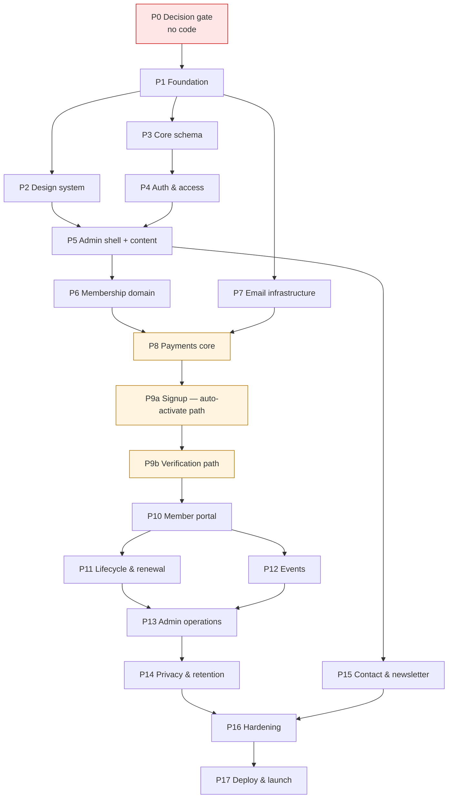

# ALDAPCON Platform — Implementation Plan (V1)

**Product:** Aldapcon — Association of Data Protection Compliance Organizations of Nigeria
**Document:** 06-implementation-plan.md
**Companion to:** 01-prd.md, 02-trd.md, 03-app-flow.md, 04-ui-ux-brief.md, 05-backend-schema.md
**Amended by:** 07-change-set-01-certificate-verification.md
**Audience:** AI coding agent, supervised by the solo builder
**Version:** 1.1
**Status:** Phase 1 scaffold delivered, awaiting local verification. Phase 2 next.

> **Version 1.1 incorporates change set 01.** PRD Q3 is answered: an administrator vets an uploaded NDPC certificate before membership is valid, scoped per category. Phases 6, 7, 9, 10, 13, 14 and 16 are affected; Phase 9 splits into 9a and 9b. Roughly +15–20% V1 effort.

---

## 0. Project Inspection

**Inspection performed before planning. Result: greenfield.**

The working tree contains the five approved documents and the original brief. There is no `composer.json`, no `package.json`, no `artisan`, no `.git`, and no source files of any kind.

Consequences:

- There are **no existing conventions to reuse**, so this plan establishes them in Phase 1 and every later phase must follow them without deviation.
- The TRD stack (Laravel 12, PostgreSQL 16, Redis, Filament, Nginx on a Lagos VPS) is adopted in full. Nothing is being migrated or retrofitted.
- Every phase below assumes it is building on the phase before it, not on anything pre-existing.

### 0.1 Current status

| Phase | Status |
|---|---|
| 0 — Decision gate | B-1 and B-2 answered. B-3, B-4, B-5, B-6 still open |
| 1 — Foundation | **Scaffold delivered.** Docker environment, tooling, CI, conventions and infrastructure tests written. Not yet executed — no PHP runtime was available where it was authored, so first verification is `./bin/setup.sh` on the builder's machine |
| 2 — Design system | Next |

Phase 1 is complete only when the four checks pass locally and CI is green.

---

## 1. Blockers and Contradictions

**These must be resolved before the phases they gate. Several are cheap to answer now and expensive to answer later.**

### 1.1 Hard blockers

| # | Issue | Gates | Why it cannot wait |
|---|---|---|---|
| ~~B-1~~ | **RESOLVED — Laravel confirmed.** The stack in `02-trd.md` stands. | — | Phase 1 scaffold built on it |
| ~~B-2~~ | **RESOLVED — yes, with certificate upload, scoped per category.** Applicants in categories where `requires_verification` is true upload their NDPC certificate; an administrator approves before membership is created. Individual DPO categories still auto-activate. Full specification in `07-change-set-01`. | — | Answered before the first migration was written, exactly as intended. Nothing built so far is wasted |
| **B-3** | **PRD Q1 — real membership categories and fees.** | **Phase 6 (public), Phase 9 (payment)** | Placeholders are fine for building; the join flow cannot go live without real approved figures. Also unresolved: PRD Q8, whether the membership year is rolling or fixed, which changes the renewal date arithmetic in Phase 11 |
| **B-4** | **Paystack KYC status.** | **Phase 8** | The longest lead-time item in the whole project (TRD §12). Live keys are needed before Phase 8 can be verified end to end. Start today regardless of build progress |
| **B-5** | **TRD Q3 — email provider decision**, and the underlying conflict between Nigeria-only residency and AC-F10's inbox-placement bar (TRD §11.1). | **Phase 7** | Domain, SPF, DKIM and DMARC setup has DNS propagation and warm-up time. Deciding in Phase 7 delays Phase 9 |
| **B-6** | **Rejection refund policy.** An administrator can now refuse membership after payment has been taken, and no policy exists for the money. | **Phase 9b go-live, Phase 13** | J-11 has no copy and D-23's reject action has no financial consequence without it. More importantly the terms must appear on J-02 **before** anyone pays — an association of compliance organisations taking a fee and declining the service with no published terms is precisely what it would pull a member up for |

### 1.2 Contradictions found across the five documents

| # | Contradiction | Resolution proposed | Confirm by |
|---|---|---|---|
| **C-1** | **PRD FR-3.10** forbids a duplicate active membership but never says where the check runs. App Flow G-1 and Schema §4.1 both place it at J-02, before Paystack is called. | Adopt the schema's position: check before payment. The database partial unique index is a backstop only — reaching it means somebody already paid for nothing | Phase 9 |
| **C-2** | **PRD FR-5.5** gives members announcements; nothing in FR-9 or FR-10 says who creates them. Schema `announcements` and App Flow D-15 are both derived (G-6, Schema Q7). | Build them. FR-5.5 is otherwise unimplementable. **This is the only table in the schema created from inference rather than a stated requirement** | Phase 3 |
| **C-3** | **PRD FR-3.8** says a paid applicant may return "at any time", but an unexpiring signed link that creates an account with a password is a security weakness (App Flow G-3). | Long-lived token (proposed: 90 days) plus the J-09 resend screen. Needs a stated number | Phase 9 |
| **C-4** | **PRD FR-4.3** makes 2FA mandatory for admins but specifies no enrolment screen (App Flow G-4, screen A-07). | Build A-07. Without it the first admin login cannot complete | Phase 4 |
| **C-5** | **TRD §2.3** puts sessions in Redis; **App Flow M-11** offers active-session management. Schema Q2 notes there is no sessions table. | M-11 is a derived, unapproved screen. **Drop session management from V1**; keep in-session password change only | Phase 10 |
| **C-6** | **PRD FR-9.7** describes Publisher as "content only", but App Flow D-07/D-08 and Schema §2.2 both grant Publisher event management. | Events are content for this purpose. Publisher gets `content.manage` and `events.manage`, and no grant that touches members or payments | Phase 4 |
| **C-7** | **PRD NFR 6.4** targets 99.5% uptime; **TRD §11.3** recommends restating it as best-effort on a single VPS. Unresolved. | Restate as best-effort for V1 and tell the association plainly. Otherwise Phase 17 has a launch criterion that cannot be met | Phase 17 |
| **C-8** | **UI brief F-1**: the admin panel is Filament, which ships its own design system. Applying the full design brief to admin means fighting the framework. | Theme Filament with colour, type and radius tokens only. Member-facing product carries the full system | **Phase 5 — before any admin UI work** |
| **C-9** | **App Flow G-8**: event oversell can occur when payment verifies after the last seat is taken. Schema §4.5 converts it to a database error but no refund path exists. | Needs a defined refund-and-notify procedure | Phase 12 |
| **C-10** | **PRD Q4**: no terminal state for an applicant who pays and never registers. Schema carries `abandoned` and `refunded` statuses with no transition into either. | Needs a policy — refund, hold, or forfeit after a stated period | Phase 13 |
| **C-11** | **App Flow G-12**: erasure requested by a member with a live paid membership has no policy. Schema §6.3 has the mechanics, not the decision. | Needs a decision on whether membership ends and whether the fee is refunded | Phase 14 |
| **C-12** | **App Flow G-2**: newsletter double opt-in (AC-F7) has no confirmation landing screen in the PRD. P-17 is derived. | Build it. Double opt-in cannot function without a landing page | Phase 15 |
| **C-13** | **PRD §8.2 metric "applications requiring manual admin intervention < 10%" is now unachievable**, because every verifying application requires manual intervention by design. | Replace with: non-verifying applications < 10%; median decision time under 2 working days; zero applications waiting over 5 days. A queue nobody works turns the fastest path into the slowest, and the applicant has already paid | Phase 13 |
| **C-14** | **Change set 01 reverses an earlier decision.** `pending_verification` was to be added to `membership_status`; it is instead added to `applicant_status`, and no membership row exists until approval. | A pending applicant is not a member. Keeping them out of `memberships` preserves `membership_number NOT NULL` and leaves every dashboard count and the one-live-membership-per-user constraint untouched | Phase 6 |

### 1.3 Missing information that is not blocking

Launch content (bios, photos, FAQ answers, initial posts — PRD A7); hosting provider selection and its processor DPA (TRD Q2); infrastructure budget (TRD Q4); Cloudflare proxy-versus-DNS-only decision (TRD Q5); named backup maintainer (TRD Q7); whether a public member directory joins V1 (PRD Q7 / Schema Q6); renewal window policy (App Flow G-11).

---

## 2. Build Conventions

Binding on every phase. The agent does not deviate without an explicit instruction.

**Structure.** Domain-oriented, per TRD §1.2:

```
app/Domain/{Content,Membership,Payments,Identity}/
    Models/  Actions/  Events/  Listeners/  Policies/  Data/
app/Http/Controllers/{Public,Portal,Webhooks}/
app/Filament/{Resources,Pages,Widgets}/
app/Jobs/  app/Mail/  app/Support/
resources/views/{layouts,components,public,portal,mail}/
database/{migrations,seeders,factories}/
tests/{Feature,Unit,Browser}/
```

Cross-domain model imports are prohibited outside declared interfaces. Membership reacts to `PaymentVerified`; it never calls into Payments.

**Rules that apply everywhere.**

1. Money is `BIGINT` kobo. Every column and variable carrying an amount is suffixed `_kobo`. No floats, ever.
2. Timestamps are `TIMESTAMPTZ` in UTC, rendered Africa/Lagos.
3. Every model has a factory. Every migration is reversible.
4. No `env()` calls outside `config/`.
5. No secrets in code, fixtures or tests. `.env.example` documents keys with empty values.
6. Authorisation is checked server-side on every route, including admin. Hiding a menu item is not authorisation.
7. Mass assignment is guarded on every model.
8. Every user-facing string is written per the UI brief §11 — sentence case, names the outcome, never "Submit".
9. Every list view ships its empty state in the same commit as the list.
10. Pint, PHPStan (level 5+) and Pest must pass before a phase is called complete.
11. One phase, one branch, one PR. A phase is not complete until its completion criteria are demonstrably met.
12. Never `--force` a migration on production without a preceding dump.

**Verification tooling** (installed in Phase 1): Pest, Pint, Larastan, Mailpit, Laravel Telescope (local and staging only), axe-core and Lighthouse CI in GitHub Actions.

---

## 3. Phase Sequence



Phases 8, 9a and 9b are amber: they handle money and are where a defect costs real naira and real trust. They get the heaviest test coverage and should not be rushed to unblock later phases.

**9a ships first and stands alone.** The auto-activating path is a complete, launchable journey for non-verifying categories. 9b adds the verification path on top. Keeping them separate means a defect in the review queue cannot break the fast path.

---

## 4. Phases

---

### Phase 0 — Decision gate *(no code)*

**Goal.** Clear the blockers that would force rework if answered later.
**User-visible outcome.** None. This is a gate.

**Actions.**
1. ~~Confirm B-1~~ — **done.** Laravel confirmed.
2. ~~Answer B-2~~ — **done.** Certificate verification, per category. See `07-change-set-01`.
3. Start B-4 (Paystack KYC) in parallel with everything else. **Still open.**
4. Decide B-5 (email provider) and begin DNS and domain authentication. **Still open.**
5. Answer B-6 (rejection refund policy). **New, opened by change set 01.**
6. Confirm C-1, C-2, C-4, C-6, C-8, C-13, C-14.
7. Shortlist the Lagos hosting provider and request a written processor DPA (TRD Q2).

**Dependencies.** None.
**Completion criteria.** B-1 and B-2 answered (done); B-5 and B-6 answered in writing; contradictions confirmed; Paystack KYC submitted; hosting shortlist with DPA availability confirmed.
**Risk.** Skipping this to "start building" is the most expensive mistake available in this project. B-2 was answered before the first migration was written, which is exactly what this gate exists to achieve — B-6 now needs the same treatment before Phase 9b goes live.

---

### Phase 1 — Foundation

**Goal.** A running Laravel application with the full local toolchain and green CI.
**User-visible outcome.** A default page at `localhost` and a passing test suite. Nothing for the association yet.

**PRD requirements.** None directly. Enables everything.

**Components and data.** Laravel 12 skeleton; PostgreSQL 16 and Redis via Docker Compose; queue worker and scheduler processes; framework tables (`migrations`, `jobs`, `job_batches`, `failed_jobs`, `cache`, `cache_locks`).

**Files and areas.**
```
composer.json, package.json, docker-compose.yml, Dockerfile
.env.example, phpunit.xml, pint.json, phpstan.neon
.github/workflows/ci.yml
config/{database,queue,session,cache,filesystems,app}.php
tests/Pest.php, tests/TestCase.php
README.md  ← setup runbook, written now while it is fresh
```

**Dependencies.** Phase 0 (B-1).

**States.** Not applicable — no user surface yet.

**Tests and verification.**
- `php artisan test` passes on a bare install.
- CI runs Pint, PHPStan and Pest on push and blocks merge on failure.
- A dispatched test job is consumed by the worker.
- A scheduled test command fires via `schedule:run`.
- Redis is confirmed as the session and cache driver.
- `docker compose up` produces a working environment from a clean clone.

**Completion criteria.** A second machine can clone the repo, follow the README, and reach a working local environment in under 15 minutes. CI is green.

**Risks and rollback.** Low. Rollback is deleting the branch. The one real risk is skipping the queue and scheduler setup here and discovering in Phase 7 that emails never send.

---

### Phase 2 — Design system and layout shell

**Goal.** The visual system from the UI brief, implemented as reusable Blade components.
**User-visible outcome.** A styled but empty site: header, footer, navigation, typography, buttons, form controls, and working 404 and 500 pages.

**PRD requirements.** FR-1.5 (navigation and footer), AC-F1 (404), NFR 6.5 (accessibility foundations), NFR 6.3 (font budget).

**Components.** Tailwind config carrying every token from UI brief §2–§4; `<x-button>` (four variants, three sizes), `<x-input>`, `<x-select>`, `<x-checkbox>`, `<x-consent-checkbox>`, `<x-alert>`, `<x-badge>` (status, with shape signal), `<x-empty-state>`, `<x-record-block>`; layouts for public, portal and form containers; header, mobile menu, footer; cookie banner **shell only** (wiring in Phase 14); skip-to-content link.

**Routes.** `/` placeholder, 404 and 500 handlers.

**Files.**
```
tailwind.config.js, resources/css/app.css
resources/views/layouts/{public,portal,form}.blade.php
resources/views/components/**
resources/views/errors/{404,500}.blade.php
public/fonts/  ← subsetted WOFF2, Literata + Archivo
```

**Dependencies.** Phase 1. C-8 confirmed (so the agent knows not to extend this system into Filament later).

**States.** Every component ships default, hover, focus-visible, active, disabled, loading, error, success, selected and read-only per UI brief §6. A component without all applicable states is incomplete.

**Tests and verification.**
- Component render tests for each variant.
- **Contrast verification against the calculated ratios in UI brief §2.2** — the numbers are stated; confirm the implementation matches.
- Keyboard-only pass over header, mobile menu and a sample form.
- Focus indicator visible on every interactive element.
- Font payload measured against the **180 KB budget** (UI brief F-10).
- Lighthouse on the placeholder home page.

**Completion criteria.** A component gallery page renders every component in every state. Font budget met. No contrast failure. Keyboard navigation works throughout.

**Risks.** Font budget overrun — mitigation is stated in UI brief F-10 (drop Literata italic first, never add a third family). Building components that later phases do not use; mitigate by building only what the app flow screens require.

---

### Phase 3 — Core schema, roles and audit

**Goal.** The identity, content-support and governance tables, with the audit log properly locked down.
**User-visible outcome.** None directly. Seeded roles and policy versions exist.

**PRD requirements.** FR-9.7 (roles), FR-9.8 (audit log), FR-12.4 (policy versions), FR-1.3, NFR 6.5 (media alt text), NFR 6.6 (settings).

**Data.** Extensions `citext` and `pgcrypto`; enum types; `users`, `login_attempts`, `password_reset_tokens`; spatie permission tables; `media`, `policy_versions`, `settings`, `activity_log`; `pages`, `leadership_profiles`, `faqs`, `announcements`, `slug_redirects`.

**Files.**
```
database/migrations/**  (one per table, dependency-ordered)
database/seeders/{RoleSeeder,PolicyVersionSeeder,SettingsSeeder,SystemPageSeeder}.php
database/factories/**
app/Domain/Identity/Models/User.php
app/Domain/Content/Models/{Page,LeadershipProfile,Faq,Announcement,Media}.php
```

**Dependencies.** Phase 1. **C-2 confirmed** before `announcements` is created — it is the one inferred table.

**Tests and verification.**
- Every migration runs up and down cleanly.
- Role and permission seeding produces exactly the sets in Schema §2.2.
- **`activity_log` grants verified:** the application role can INSERT and SELECT but UPDATE and DELETE are rejected at the database level.
- `media.alt_text` NOT NULL is enforced — an insert without alt text fails.
- Factories produce valid rows for every model.

**Completion criteria.** `migrate:fresh --seed` produces a database with four roles, their permissions, three policy versions, default settings and six system pages. The audit log rejects updates.

**Risks.** Enum values are permanent in Postgres, so every enum defined here is reviewed before it is written. B-2 is answered, so the Phase 6 enums it governs are settled. Rollback is `migrate:rollback`, safe while there is no production data.

---

### Phase 4 — Authentication and access control

**Goal.** Working login, password reset, email verification, mandatory admin 2FA, lockout, and enforced role permissions.
**User-visible outcome.** A person can log in and out. An admin must complete 2FA. A publisher is refused member data.

**PRD requirements.** FR-4.1–4.5, AC-F4, AC-F9, and the derived A-07 (C-4).

**Screens.** A-01 login, A-02 forgot password, A-03 reset, A-04 verify notice, A-05 verified, A-06 2FA challenge, **A-07 2FA enrolment**, A-08 locked, A-09 403.

**Routes.** `/login`, `/logout`, `/forgot-password`, `/reset-password/{token}`, `/verify-email`, `/verify-email/{id}/{hash}`, `/two-factor-challenge`, `/admin/two-factor-setup`.

**Services.** Laravel Fortify; `spatie/laravel-permission`; policy classes per domain; a middleware requiring confirmed 2FA for any `admin` or `super_admin` route.

**Files.**
```
config/fortify.php, app/Providers/FortifyServiceProvider.php
app/Http/Middleware/RequireTwoFactor.php
app/Domain/Identity/{Actions,Policies}/**
resources/views/auth/**
tests/Feature/Auth/**
```

**Dependencies.** Phases 2 and 3. **C-4 and C-6 confirmed.**

**States.** Loading on every submit with the button disabled. Invalid credentials return a generic message that never reveals whether the email exists. Lockout states the cooldown. Post-login redirect honours the intended destination. Unverified email diverts to A-04.

**Tests and verification.**
- **Tier 1 (TRD §8):** every role against every protected route by direct URL; a Publisher reaching for `/admin/members` and `/admin/payments` gets 403.
- Six consecutive failed attempts trigger lockout; the seventh is refused.
- Reset links are single-use and expire; a reused link shows the recovery path.
- An admin without confirmed 2FA is forced to A-07 and cannot bypass it by direct URL.
- Recovery codes work once each.
- Successful password reset invalidates other sessions.
- Manual: keyboard-only pass over the full login and reset journey.

**Completion criteria.** All Tier 1 authorisation tests pass. No admin route is reachable without confirmed 2FA. Enumeration is impossible through login, reset or verification responses.

**Risks.** Authorisation bugs are the highest-severity class in this application. Mitigation: test by direct URL, never by clicking through the UI. Rollback is straightforward — no production users exist yet.

---

### Phase 5 — Admin shell and content management

**Goal.** Filament installed and themed, with full content management and the public content pages that consume it.
**User-visible outcome.** The association can publish news, edit pages, manage leadership profiles and FAQs, and the public site shows them. Site search works.

**PRD requirements.** FR-1.1, FR-1.2, FR-1.3, FR-1.5, FR-1.6, FR-7.1–7.4, FR-12.4, NFR 6.6, NFR 6.7, AC-F1, AC-F7.

**Screens.** Public P-01 to P-03, P-05, P-06, P-09, P-11 to P-14. Admin D-10 to D-14, plus a minimal D-01 shell.

**Routes.** `/`, `/about`, `/leadership`, `/news`, `/news/{slug}`, `/faq`, `/search`, `/privacy-policy`, `/cookie-policy`, `/terms`, `/admin/*`.

**Data.** `posts`, `content_terms`, `post_term`, plus the Phase 3 content tables. `search_vector` GIN indexes on `posts`, `pages`, `faqs`.

**Files.**
```
app/Filament/Resources/{PostResource,PageResource,LeadershipProfileResource,FaqResource}.php
app/Providers/Filament/AdminPanelProvider.php   ← token theming only (C-8)
app/Domain/Content/{Models,Actions}/**
app/Http/Controllers/Public/{HomeController,NewsController,PageController,SearchController}.php
resources/views/public/**
database/migrations/*_create_posts_*.php
```

**Dependencies.** Phases 2 and 4. **C-8 confirmed before any Filament styling work begins.**

**States.**
- *Loading:* server-rendered, none on public pages; skeletons in Filament tables only.
- *Empty:* no published posts hides the home Latest band entirely; empty news index shows a single honest line; a filtered index with no matches offers a clear-filter action; leadership and FAQ pages are unlinked from navigation until populated.
- *Error:* 404 for unknown or unpublished slugs; 500 page with no stack trace.
- *Success:* publishing confirms inline and the post appears publicly.

**Tests and verification.**
- Draft and scheduled posts 404 for the public (AC-F7).
- A scheduled post appears automatically at its time, with no manual action.
- Changing a slug leaves a working 301 via `slug_redirects`.
- Search returns published matches and never returns drafts.
- Home page shows exactly three latest posts and reflects content changes.
- Alt text is required at upload and rejected without it.
- Social preview metadata renders correctly for a post URL.
- Manual: publish a real post end to end; check Lighthouse and axe on the news index and a post.

**Completion criteria.** A non-technical administrator can publish, schedule, edit and unpublish a post, and edit every public page, without a developer. Search works. Lighthouse mobile ≥ 80 on Home, news index and a post.

**Risks.** **The largest schedule risk in the project is over-customising Filament** (UI brief F-1). The agent applies colour, typeface and radius tokens and accepts Filament's component patterns. Any request to restyle Filament components deeply is escalated, not absorbed.

---

### Phase 6 — Membership domain

**Goal.** The membership data model, category management, and the public membership page. No payment yet.
**User-visible outcome.** The association can define categories and fees; the public can read them. Join buttons are present but lead nowhere until Phase 9.

**PRD requirements.** FR-1.4, FR-2.1, FR-2.2, FR-3.11 (numbering), FR-6.1, AC-F2.

**Screens.** P-04 membership overview, J-01 category selection, D-06 categories admin.

**Data.** `membership_categories`, `membership_number_counters`, `applicants`, `memberships`, `member_profiles`, `membership_status_history`, `renewal_reminders`, **`member_documents`**.

**Change set 01 additions.**
- `membership_categories.requires_licence_number` becomes **`requires_verification`**.
- `applicant_status` enum becomes `initiated | paid | pending_verification | registered | rejected | abandoned | refunded`.
- `applicants` gains `submitted_at`, `reviewed_at`, `reviewed_by_user_id`, `review_decision`, `review_reason`, `correction_requested_count`, `user_id`.
- New enums `review_decision` and `document_type`.
- New table `member_documents` — private disk, `sha256`, `superseded_by_id`, MIME allow-list constraint.
- **`membership_status` is unchanged** (C-14). A pending applicant has no membership row.

**Files.**
```
database/migrations/*_create_membership_*.php
app/Domain/Membership/Models/{MembershipCategory,Applicant,Membership,MemberProfile}.php
app/Domain/Membership/Actions/AllocateMembershipNumber.php
app/Filament/Resources/MembershipCategoryResource.php
app/Http/Controllers/Public/MembershipController.php
```

**Dependencies.** Phase 5. **B-2 is answered**, so the enums can be written correctly the first time — which was the entire reason for gating this phase on it. **B-3** needed for real content, not for the build.

**States.**
- *Empty:* no active category disables all Join calls to action with a "membership opens shortly" message **and alerts an admin** — this is a launch-blocking misconfiguration, not a normal state.
- *Expired member viewing P-04:* renewal prompt instead of a join prompt.
- *Error:* category deactivated mid-flow blocks with an explanation.

**Tests and verification.**
- **Concurrency test: two simultaneous number allocations produce different numbers** (AC-F3). This is the test that matters most in this phase.
- Number format and per-category sequencing are correct.
- Deactivating a category removes it from the public flow but preserves its members (AC-F2).
- A fee change does not alter any historical value.
- The partial unique index rejects a second live membership for one user.
- `requires_verification` toggles correctly per category and is editable without code.
- `member_documents` rejects a disallowed MIME type at the database level.
- Manual: create categories in the admin panel and verify the public page.

**Completion criteria.** Categories are fully manageable without code, including the verification flag. The concurrency test passes repeatedly. All membership migrations run up and down cleanly.

**Risks.** Enum values are permanent in Postgres. B-2 is answered, so this phase writes them correctly the first time. Rollback is clean only while no production data exists.

---

### Phase 7 — Email infrastructure

**Goal.** Reliable, authenticated transactional email with a delivery log.
**User-visible outcome.** Password reset and verification emails, already built in Phase 4, actually arrive in real inboxes.

**PRD requirements.** FR-10.1, FR-10.2, FR-10.3, AC-F10.

**Components.** Mail provider configuration; SPF, DKIM and DMARC on the association domain; a branded Blade mail layout following the UI brief; `email_log` writes on send and failure; queued mailables with retry and backoff; Mailpit locally.

**Change set 01 additions.** Three further mailables: **application acknowledgement** (sent on submission for review), **approval** (replaces the welcome email on the verifying path), and **rejection** (with the administrator's reason).

**Files.**
```
config/mail.php
app/Mail/**  (base mailable + layout)
app/Domain/Identity/Models/EmailLog.php
resources/views/mail/{layout,components}/**
database/migrations/*_create_email_log_*.php
```

**Dependencies.** Phase 1. **B-5 answered and DNS records live.**

**States.** Queued, sent and failed are all recorded. A failed send retries with backoff and, on final failure, alerts rather than disappearing into `failed_jobs`.

**Tests and verification.**
- Mailable render tests for the layout.
- `email_log` records both success and failure paths.
- **Manual, and non-negotiable:** send to real Gmail, Yahoo and Outlook accounts and confirm inbox placement, not spam (AC-F10).
- SPF, DKIM and DMARC verified with an external checker.
- Mobile rendering checked on Gmail app and Outlook.
- Confirm no email body content is stored in `email_log` — metadata only.

**Completion criteria.** Test emails reach the inbox on all three providers. Authentication records pass. Failures are logged and alerted.

**Risks.** **This is where TRD §11.1 becomes concrete.** If the residency-compliant option is chosen and inbox placement fails, the decision must be revisited before Phase 9, not after launch. Do not proceed to Phase 9 with emails landing in spam — the entire signup flow depends on two emails arriving.

---

### Phase 8 — Payments core

**Goal.** Paystack integration with verified, idempotent webhook handling. No user-facing flow yet.
**User-visible outcome.** None. Verified entirely by tests and the Paystack test dashboard.

**PRD requirements.** FR-3.3, FR-3.4, FR-3.5, FR-3.9, FR-9.6, AC-F3 (payment integrity portions).

**Data.** `payments`, `payment_webhook_events`, `receipts`, `refunds`.

**Services.** `PaystackGateway` (initialize, verify); `POST /webhooks/paystack` excluded from CSRF **by exact path only**; signature verification using HMAC SHA512 over the **raw request body**; `ProcessPaystackWebhook` queued job; `PaymentVerified` domain event; receipt PDF generation.

**Files.**
```
app/Domain/Payments/{Models,Actions,Events,Services}/**
app/Http/Controllers/Webhooks/PaystackWebhookController.php
app/Jobs/ProcessPaystackWebhook.php
config/services.php
tests/Feature/Payments/**
```

**Dependencies.** Phases 6 and 7. **B-4 — test keys minimum; live keys before launch.**

**States.** Webhook events are `received`, `processed`, `ignored` or `failed`. A failed processing job retries and alerts. Duplicate deliveries are acknowledged with 200 and no side effect.

**Tests and verification — Tier 1, the heaviest in the project.**
- Valid signature accepted; invalid, missing and tampered signatures rejected.
- **The same event delivered twice creates exactly one payment.**
- Reading the parsed body instead of the raw body breaks the HMAC — assert against the raw body explicitly.
- A tampered client-side amount cannot change what is charged; the amount is always derived server-side from the category.
- `CHECK (num_nonnulls(...) = 1)` rejects a payment with two targets or none.
- Verify Transaction is called as a second confirmation after the webhook.
- Receipt PDF contains association details, member details, amount, purpose, date and reference (AC-F5).
- Manual: a full Paystack test-mode transaction, with the webhook received and verified end to end.

**Completion criteria.** Every Tier 1 payment test passes. A test-mode payment produces exactly one payment row, one webhook event row and one receipt. Replaying the webhook changes nothing.

**Risks and rollback.** Highest-risk phase in the build. A defect here means lost or duplicated money. **Do not shorten the test list to move faster.** Rollback is safe while no live keys are configured; once live, any change to webhook handling requires a staging replay of recorded payloads first.

---

### Phase 9a — Signup and activation (auto-activate path)

**Goal.** The primary journey, working end to end, for categories that do not require verification.
**User-visible outcome.** Somebody in a non-verifying category can join, pay and receive a membership number without any human involvement.

**PRD requirements.** FR-3.1, FR-3.2, FR-3.6, FR-3.7, FR-3.8, FR-3.10, FR-12.2, AC-F3, AC-F12.

**Screens.** J-01 to J-09, plus the derived J-08 and J-09 (C-3).

**Routes.** `/join`, `/join/{category}`, `/join/confirming/{reference}`, `/join/failed/{reference}`, `/join/register/{token}`, `/join/welcome`, `/join/resend`.

**Services.** `CreateApplicant` (with the **pre-payment duplicate check**, C-1); `ActivateMembership` (the single transaction from Schema §4.3); signed-token issuing and hashing; consent recording; receipt, registration-link and welcome mailables.

**Files.**
```
app/Domain/Membership/Actions/{CreateApplicant,ActivateMembership,IssueRegistrationToken}.php
app/Domain/Membership/Listeners/ActivateOnPaymentVerified.php
app/Http/Controllers/Public/JoinController.php
app/Mail/{PaymentReceipt,RegistrationLink,WelcomeMember}.php
resources/views/public/join/**
tests/Feature/Signup/**
```

**Dependencies.** Phase 8. **C-1 and C-3 confirmed; B-3 for real fees before go-live.**

**States.** This phase has the most demanding state work in the product.
- *Loading:* J-04 polls with progressive reassurance; after the ceiling it degrades to "we will email you" and **never claims failure while pending**.
- *Empty:* no active categories blocks the flow with an explanation.
- *Error:* duplicate active member stops **before** payment with a login route; payment failure offers retry with details pre-filled and no duplicate applicant; expired token routes to J-08 then J-09; **activation transaction failure leaves the payment intact, alerts an admin, and tells the applicant their payment is safe**.
- *Success:* J-07 shows the Membership Record block; welcome email queued after commit.

**Tests and verification.**
- **Redirect-without-payment does not activate a membership** — the single most important security test in the build.
- Full flow: category → details → test payment → webhook → registration → active membership.
- Duplicate active email is blocked at J-02 with no Paystack call made (C-1).
- Abandon after payment, return days later via the emailed link, complete successfully.
- Expired token → J-08 → J-09 → new link → completes.
- J-09 returns an identical neutral response whether or not the email matches an applicant.
- Double-submitting the registration form yields one membership.
- Activation rollback leaves no partial user, profile or membership.
- Consent records capture policy version, timestamp and IP (AC-F12).
- Manual: complete the whole flow on a mid-range Android phone over 4G, keyboard-only on desktop, and confirm it takes under five minutes (AC-NFR).

**Completion criteria.** Every AC-F3 criterion passes. Three end-to-end test-mode signups complete cleanly. The abandoned-payment path recovers fully.

**Risks.** A paid applicant who cannot activate is the worst state in the product. Mitigations: single transaction, queue retries, admin alerting, and the D-04 queue in Phase 13 making it visible. Rollback: this phase must not go live before Phase 13 gives admins the applicant queue.

---

### Phase 9b — Certificate verification path

**Goal.** Applicants in verifying categories upload a certificate and wait for an administrator decision.
**User-visible outcome.** A DPCO applicant pays, registers, uploads their NDPC certificate, and sees a clear pending state instead of an instant membership.

**PRD requirements.** FR-2.1, FR-3.6 (upload), FR-3.7 (conditional activation), FR-3.13.1–2, FR-5.1, AC-F16.

**Screens.** J-06 changed (conditional upload field, button becomes "Submit for verification"), **J-10 pending**, **J-12 corrected upload**. J-07 is now the non-verifying path only.

**Routes.** `/join/pending`, `/join/document/{signedToken}`.

**Services.** `SubmitForVerification` (transaction T3a from change set §5.6 — creates user, profile, document and consent, but **no membership and no membership number**); private file storage; upload validation.

**Files.**
```
app/Domain/Membership/Actions/{SubmitForVerification,StoreMemberDocument}.php
app/Domain/Membership/Models/MemberDocument.php
app/Mail/ApplicationAcknowledgement.php
resources/views/public/join/{pending,document}.blade.php
resources/views/components/file-upload.blade.php
tests/Feature/Signup/VerificationPathTest.php
```

**Dependencies.** Phase 9a. **B-6 before go-live** — the refund terms belong on J-02, before payment.

**States.**
- *Loading:* the upload control needs its own full state set — idle, dragging, selected, uploading with progress, complete, error, plus a reduced-motion path (UI brief F-14). An upload with no visible progress on Nigerian 4G reads as a frozen page, and the applicant has already paid.
- *Empty:* not applicable.
- *Error:* wrong file type or oversize rejected **with the limits stated before the picker, not only in the error**; upload failure preserves the rest of the form; submission failure leaves the payment intact and alerts an admin.
- *Success:* J-10 confirms payment received and certificate stored, with the submission date and expected timeframe.

**Tests and verification.**
- A verifying category creates **no membership row** at registration.
- A non-verifying category still activates immediately — 9a must not regress.
- Registration without a certificate is refused for a verifying category.
- Disallowed MIME types and oversize files are rejected.
- The stored file is **not reachable** by unauthenticated URL or direct path.
- `sha256` matches the uploaded bytes.
- Acknowledgement email sends on submission.
- A pending applicant can log in and sees the pending state, not a broken portal.
- Manual: complete the verifying path on a mid-range Android over 4G, including the upload.

**Completion criteria.** Both paths coexist correctly. No membership or number is created for a pending applicant. The certificate is unreachable without authorisation.

**Risks.** This is the only file-upload surface in the member-facing product — the natural target for a server compromise. Validation, re-encoding or sanitising, and no execution from the storage path are all mandatory, with hardening revisited in Phase 16.

---

### Phase 10 — Member portal

**Goal.** Members can see and manage their membership.
**User-visible outcome.** Login leads to a dashboard showing membership number, status, expiry, payments, receipts and announcements.

**PRD requirements.** FR-5.1 to FR-5.5, AC-F5.

**Screens.** M-01 to M-06, M-11 (password change only — C-5 drops session management).

**Routes.** `/portal`, `/portal/profile`, `/portal/payments`, `/portal/payments/{id}/receipt`, `/portal/events`, `/portal/announcements`, `/portal/security`.

**Files.**
```
app/Http/Controllers/Portal/**
app/Domain/Membership/Policies/MembershipPolicy.php
resources/views/portal/**
tests/Feature/Portal/**
```

**Dependencies.** Phase 9. **C-5 confirmed.**

**States.**
- *Loading:* server-rendered; none.
- *Empty:* new member with no events sees a getting-started state, not empty widgets; **an empty payments list is a data-integrity alarm, not an empty state** — every member has at least a registration payment.
- *Expired member:* announcements replaced by an explanation, not an empty list; renewal prompt prominent.
- *Pending applicant (change set 01):* status, submission date and what happens next. **No Membership Record block** — that block is reserved for issued membership (UI brief F-12), and showing it here would tell somebody they are a member when they are not. No renewal prompt, no payment-history prompt.
- *Rejected applicant (change set 01):* the administrator's reason and a contact route. The portal must not error for a user who has an account but no membership.
- *Error:* receipt generation failure apologises, offers retry and alerts monitoring.

**Tests and verification.**
- **Member A cannot reach member B's dashboard, profile, payments or receipts under any parameter manipulation** (AC-F5).
- Locked fields (name, email, category, status) are not self-editable and are marked `readonly`, not `disabled` (UI brief F-7).
- Receipt PDF downloads with correct content.
- Expired member loses announcements and sees the explanation.
- Manual: axe scan and keyboard pass on the portal dashboard.

**Completion criteria.** Ownership isolation proven by test. Every portal screen has its empty and error states. Receipts download correctly.

**Risks.** Ownership bugs leak member data. Test by direct URL manipulation, never by clicking.

---

### Phase 11 — Lifecycle and renewal

**Goal.** Membership expires, reminds and renews correctly without human involvement.
**User-visible outcome.** Members receive reminders and can renew in a few taps. Status changes automatically.

**PRD requirements.** FR-6.1 to FR-6.6, AC-F6.

**Screens.** M-07, M-08, M-09.

**Services.** Daily `TransitionMembershipStatuses` command; `SendRenewalReminders` with the `(membership_id, cycle_expires_at, stage)` uniqueness guarantee; `RenewMembership` action with both date branches.

**Files.**
```
app/Console/Commands/{TransitionMembershipStatuses,SendRenewalReminders}.php
app/Domain/Membership/Actions/RenewMembership.php
app/Mail/RenewalReminder.php
app/Http/Controllers/Portal/RenewalController.php
routes/console.php
```

**Dependencies.** Phase 10. **PRD Q8 (rolling vs fixed year) affects the arithmetic.**

**States.** Renewal screen shows the resulting new expiry **before** payment. Confirming mirrors J-04 exactly. Failure leaves the membership unchanged and says so.

**Tests and verification — all with a frozen test clock.**
- Transitions at 31, 30, 8, 7, 2, 1, 0 and −1 days from expiry.
- Reminders fire at each stage exactly once; a re-run sends nothing.
- **A member who renews and reaches the next cycle receives reminders again** — the year-two bug the cycle key prevents.
- Renewing 10 days early sets expiry to old expiry + 12 months.
- Renewing 40 days late sets expiry to payment date + 12 months.
- Double-submitted renewal extends 12 months, not 24.
- Expired member retains login but loses member privileges.
- Admin expiry override requires a reason and writes to status history and the audit log.

**Completion criteria.** Every AC-F6 criterion passes with a test clock. Both renewal branches are correct. Reminders are provably once-per-stage-per-cycle.

**Risks.** Renewal date arithmetic is the requirement most likely to be implemented wrong (TRD §4.2). Both branches are explicitly tested. A wrong reminder key is invisible until year two — hence the cycle test.

---

### Phase 12 — Events

**Goal.** The association can run and fill events; members and visitors can register and pay.
**User-visible outcome.** Public event listings, member and non-member pricing, working registration and attendee export.

**PRD requirements.** FR-8.1 to FR-8.8, FR-5.4, AC-F8.

**Screens.** P-07, P-08, E-01 to E-04, D-07, D-08, D-09.

**Data.** `events`, `event_speakers`, `event_registrations`.

**Files.**
```
database/migrations/*_create_events_*.php
app/Domain/Content/Models/{Event,EventSpeaker,EventRegistration}.php
app/Domain/Content/Actions/RegisterForEvent.php
app/Filament/Resources/EventResource.php
app/Http/Controllers/Public/EventController.php
```

**Dependencies.** Phases 8 and 10. **C-9 (oversell refund path) needed before go-live.**

**States.**
- *Empty:* no upcoming events shows past events with a note; none at all shows one line.
- *At capacity:* E-04 inline, register disabled with a clear message.
- *Past:* registration section replaced, page stays live for SEO.
- *Expired member:* non-member price **with an explanation and a renewal link** (App Flow G-7) — not silently treated as a stranger.
- *Error:* oversell after payment alerts an admin and triggers the refund path.

**Tests and verification.**
- Active member sees member price; visitor and expired member see non-member price.
- Concurrent registration for the last seat does not oversell.
- The `CHECK (confirmed_count <= capacity)` constraint fires rather than allowing a silent oversell.
- Free events skip payment entirely.
- Registration refused at capacity and after the event date.
- Attendee CSV opens correctly in Excel and Google Sheets with Nigerian names intact (UTF-8 BOM).
- Manual: create an event, register as member and as visitor, export attendees.

**Completion criteria.** All AC-F8 criteria pass. The concurrency test holds. The expired-member pricing message is in place.

**Risks.** Oversell is a real race that the database constraint surfaces but does not prevent (Schema §4.5). C-9 must define the refund procedure before events go live.

---

### Phase 13 — Admin operations

**Goal.** The secretariat can run membership without a spreadsheet.
**User-visible outcome.** A dashboard with reconcilable numbers, three working queues, member management and exports.

**PRD requirements.** FR-9.1 to FR-9.6, FR-9.8, FR-3.8 (D-04 queue), AC-F9.

**Screens.** D-01 to D-05, D-15 to D-21, plus **D-22 verification queue**, **D-23 application review**, **D-24 authenticated certificate stream**.

**Change set 01 additions.** Transactions T3b (approve — allocates the number and creates the membership) and T3c (reject — touches no counter). Dashboard gains an ageing verification widget. New permissions `verifications.view`, `verifications.decide`, `documents.view`, none of which Publisher receives.

**Files.**
```
app/Filament/Resources/{MemberResource,ApplicantResource,PaymentResource,
                        AnnouncementResource,EnquiryResource,UserResource}.php
app/Filament/Widgets/**
app/Domain/Membership/Actions/{DeactivateMembership,OverrideExpiry}.php
```

**Dependencies.** Phases 11 and 12. **C-10 (PRD Q4) needed to give D-04 a terminal action.**

**States.**
- *Empty:* an empty D-04 queue is good news and says so; zeros on the dashboard at launch are shown plainly with a getting-started prompt.
- *Ageing:* D-04 rows past a threshold are visually escalated.
- *Error:* a widget query failure degrades that widget only, not the page.

**Tests and verification.**
- **Dashboard counts reconcile exactly with the underlying lists** against a seeded dataset (AC-F9).
- Revenue counts only verified payments, never initiated ones.
- Search by partial name, email, membership number and organisation returns the right record.
- Member CSV opens correctly in Excel and Google Sheets.
- Every deactivation, reinstatement, correction, expiry override and role change writes an audit entry with actor and before/after.
- Role permissions hold under direct URL, not only hidden menus.
- A Super Admin cannot remove their own last Super Admin role.
- **A rejected application consumes no membership number** — assert the counter before and after.
- Approval allocates the next number for that category and creates exactly one membership.
- Approve and reject are idempotent under double-click.
- Two administrators reviewing concurrently: the second sees the decision already made rather than overwriting it.
- Rejection without a reason is refused.
- A Publisher cannot reach D-22, D-23 or D-24 by direct URL.
- D-22 sorts oldest first — a newest-first queue lets the oldest application rot.
- Manual: an untrained person performs the five commonest secretariat tasks unaided, including one approval and one rejection.

**Completion criteria.** Counts reconcile. Exports are correct. Every mutation is audited. The D-04 queue is usable.

**Risks.** Without C-10, the applicant queue grows with no way to clear it. Without D-04 shipping, Phase 9a should not go live at all — and without D-22 and D-23, neither should 9b.

**The new operational risk is a queue nobody works.** Verification converts the product's fastest path into a path that waits on a human who is already running everything else alone. Ageing escalation and the dashboard widget make it visible; only a named owner and an SLA make it get done.

---

### Phase 14 — Privacy, consent and retention

**Goal.** The compliance surface a data protection association will be judged on.
**User-visible outcome.** Working cookie consent, data export and erasure requests, and retention jobs that actually run.

**PRD requirements.** FR-12.1 to FR-12.4, AC-F12, NFR 6.2.

**Screens.** M-10, D-18, G-01, G-02, plus consent controls already placed in Phases 9 and 12.

**Services.** Cookie consent (client-side, per Schema §2.8 — no per-visitor table); `data_subject_requests`; the anonymisation routine from Schema §6.3; one scheduled pruning job per retention rule in Schema §6.4.

**Change set 01 additions.** Four further pruning jobs for certificates: approved and active (membership duration + 12 months), approved and lapsed (12 months after expiry), rejected (90 days), superseded by a correction (90 days). Certificates enter the erasure routine — a certificate is evidence of a decision, not a permanent record of a person, and keeping identity-adjacent documents indefinitely at a data protection association is the finding an auditor would most enjoy writing up. **The figures are proposals and need sign-off (G-18).**

**Files.**
```
app/Domain/Identity/Actions/{ExportMemberData,AnonymiseMember}.php
app/Console/Commands/Prune*.php   ← one per retention rule
app/Filament/Resources/DataSubjectRequestResource.php
resources/views/components/cookie-banner.blade.php
```

**Dependencies.** Phase 13. **C-11 (erasure with a live membership) needed.**

**States.** Banner appears on first visit only, records the choice, and is re-callable from the footer. Reject fires no non-essential script. DSR states are pending, in progress, fulfilled and refused. Erasure requires explicit confirmation.

**Tests and verification.**
- Rejecting cookies fires no non-essential script — verified by network inspection.
- Accept and Reject carry equal visual weight (UI brief F-8).
- Consent checkboxes are unticked by default, unbundled, and record version, timestamp and IP.
- **Anonymisation preserves financial reconciliation:** payment amounts, references and dates survive; personal fields do not.
- Every retention job deletes exactly what its rule specifies and nothing else.
- A policy version update leaves earlier versions retrievable.
- Manual: complete a full export and a full erasure end to end.

**Completion criteria.** Every retention rule has a scheduled, tested job. Consent evidence is complete. Erasure preserves financial records.

**Risks.** Retention jobs that are planned but never written mean indefinite retention of visitor data at a data protection association. This phase is not optional and should not be deferred to "after launch".

---

### Phase 15 — Contact, newsletter and enquiries

**Goal.** Inbound channels work.
**User-visible outcome.** Visitors can send an enquiry and subscribe to the newsletter with double opt-in.

**PRD requirements.** FR-7.5, FR-10.3, FR-11.1 to FR-11.3, AC-F7, AC-F11.

**Screens.** P-10, P-17 (derived, C-12), D-16, D-17.

**Files.**
```
app/Http/Controllers/Public/{ContactController,NewsletterController}.php
app/Filament/Resources/{EnquiryResource,SubscriberResource}.php
app/Mail/{EnquiryAcknowledgement,NewsletterConfirmation}.php
```

**Dependencies.** Phases 5 and 7. **C-12 confirmed.**

**States.** Submitting disables the button and blocks double submission. Validation errors are inline. **Send failure shows the association's direct email address** — never a dead form. Newsletter states: confirmed, already confirmed, invalid or expired token with a resubscribe route.

**Tests and verification.**
- Enquiry reaches the configured inbox and is stored; sender gets an acknowledgement.
- Automated spam submissions are blocked.
- Newsletter requires confirmation before `confirmed`; unsubscribing stops marketing but not transactional email.
- Manual: submit both forms from a phone.

**Completion criteria.** Both forms work with all states. Double opt-in functions end to end.

**Risks.** Low. Contact form failure is the one path where a silent error costs an inbound lead with no trace.

---

### Phase 16 — Hardening

**Goal.** Meet the non-functional requirements and prove it.
**User-visible outcome.** A fast, accessible, secure site.

**PRD requirements.** NFR 6.1 to 6.7, AC-NFR.

**Work.** Upload hardening for the certificate surface — MIME and extension allow-list, size cap, re-encoding or sanitising, no execution from the storage path, authenticated streaming verified under load; security headers and a strict CSP; rate limiting across auth, registration, payment initiation, document upload and contact; image derivative pipeline and lazy loading; Redis caching of category, navigation and settings lookups; N+1 elimination; index review against the FR-9.2 filter columns; accessibility remediation; load test at 500 concurrent; automated security scan; `spatie/laravel-backup` configured with an encrypted off-host target.

**Dependencies.** Phases 14 and 15.

**Tests and verification.**
- Lighthouse mobile ≥ 80 on Home, news index and a post.
- LCP under 2.5s on a mid-range Android over 4G — measured on a real device, not emulated.
- Page weight under 1.5 MB; font budget still within 180 KB.
- p95 server response under 500 ms under load.
- axe-core returns no critical violations; **manual keyboard-only and screen-reader pass over the signup flow, portal and a news post**.
- Usable at 200% zoom and at 320px width.
- No critical or high findings in the security scan.
- **A restore from backup into staging succeeds.** An untested backup is not a backup.

**Completion criteria.** Every AC-NFR criterion passes. The restore drill is completed and documented.

**Risks.** Accessibility remediation discovered this late can force component changes. Mitigation: the Phase 2 component work and the per-phase axe checks should mean few surprises remain. Automated tooling catches roughly a third of real issues; the manual pass is what makes the AA claim honest.

---

### Phase 17 — Deployment and launch

**Goal.** Production on the Lagos VPS, with staging, backups, monitoring and a go-live checklist.
**User-visible outcome.** The site is live and taking real memberships.

**Work.** Server provisioning captured as a script or Ansible playbook (TRD §10) — not for elegance, but because rebuilding after a data-centre failure with no notes is a scenario a solo maintainer will otherwise face cold. Nginx and TLS; PHP-FPM, Redis, Postgres; supervisor for queue workers; cron for the scheduler; GitHub Actions SSH deploy with symlink releases and rollback; staging on a separate database and virtual host with basic auth and `noindex`; daily encrypted backups off-host in Nigeria; uptime monitoring with SMS or WhatsApp alerts; error monitoring; secrets on the server at `chmod 600`; live Paystack keys.

**Dependencies.** Phase 16. **B-4 (live keys), TRD Q2 (provider and DPA), C-7 (uptime expectation).**

**Launch gates.**
- `APP_DEBUG=false` verified in production.
- Legal pages published and versioned.
- Real membership categories and fees loaded (B-3).
- **At least three real end-to-end paid signups completed in production** (PRD §8.1).
- One live ₦100 transaction verified before opening signups publicly.
- The secretariat trained on the admin back office.
- Backup restore drill completed.
- Runbooks written: deploy, rollback, restore, incident response, credential rotation.
- A named backup maintainer holds credentials (TRD Q7).

**Risks.** Bus factor of one (TRD §11.3). Runbooks and the named backup contact are the only mitigations available. Rollback is the previous release symlink; database migrations require a dump taken immediately before.

---

## 5. Traceability

| PRD feature | Requirement | Phase | Primary test |
|---|---|---|---|
| F1 Public site | FR-1.1–1.5 | 2, 5 | Page render, navigation, 404 status |
| F1 Search | FR-1.6 | 5 | Published matches returned, drafts never |
| F2 Categories & fees | FR-2.1, 2.2 | 6 | Fee change does not alter historical payments |
| F3 Signup & payment | FR-3.1–3.5, 3.9 | 8, 9 | Redirect without payment does not activate |
| F3 Registration | FR-3.6, 3.7 | 9 | Activation transaction is all-or-nothing |
| F3 Abandoned payment | FR-3.8 | 9 | Return via emailed link days later completes |
| F3 Duplicate prevention | FR-3.10 | 9 | Blocked at J-02 with no Paystack call |
| F3 Membership numbers | FR-3.11 | 6 | Concurrent allocation yields distinct numbers |
| F16 Certificate upload | FR-2.1, FR-3.6 | 6, 9b | Rejects wrong type and oversize; stored privately |
| F16 Pending state | FR-3.7, FR-5.1 | 9b, 10 | No membership row exists; portal renders pending |
| F16 Verification queue | FR-3.13.1, FR-9.1 | 13 | Oldest first; ageing escalation; counts reconcile |
| F16 Approval | FR-3.13.3 | 13 | Allocates next number; idempotent under double-click |
| F16 Rejection | FR-3.13.4 | 13 | **Consumes no membership number**; reason mandatory |
| F16 Document access | FR-3.13.2 | 13, 16 | Unauthenticated and Publisher access both refused |
| F16 Verification audit | FR-3.13.6 | 13 | Every decision logged with actor and reason |
| F16 Certificate retention | Change set §5.4 | 14 | Each rule deletes exactly its scope |
| F4 Accounts & auth | FR-4.1–4.5 | 4 | Direct-URL authorisation per role; lockout at six |
| F5 Member portal | FR-5.1–5.5 | 10 | Member A cannot read member B under any parameter |
| F5 Receipts | FR-5.3, AC-F5 | 8, 10 | Receipt PDF content and download |
| F6 Renewal & lifecycle | FR-6.1–6.6 | 11 | Test-clock transitions; both renewal branches |
| F7 News | FR-7.1–7.4 | 5 | Drafts 404; scheduled post auto-publishes |
| F7 Newsletter | FR-7.5 | 15 | Double opt-in required before confirmed |
| F8 Events | FR-8.1–8.8 | 12 | Concurrent last-seat registration does not oversell |
| F9 Admin dashboard | FR-9.1 | 13 | Counts reconcile with underlying lists |
| F9 Member management | FR-9.2–9.5 | 13 | Search, filter, CSV encoding |
| F9 Payments view | FR-9.6 | 8, 13 | Every transaction visible with gateway reference |
| F9 Roles | FR-9.7 | 4 | Publisher refused member and payment data by URL |
| F9 Audit log | FR-9.8 | 3, 13 | UPDATE and DELETE rejected at database level |
| F10 Notifications | FR-10.1–10.3 | 7, 9, 11 | Inbox placement on Gmail, Yahoo, Outlook |
| F11 Contact | FR-11.1–11.3 | 15 | Enquiry stored and acknowledged; spam blocked |
| F12 Privacy & consent | FR-12.1–12.4 | 14 | Rejecting cookies fires no non-essential script |
| F12 Data rights | FR-12.3 | 14 | Anonymisation preserves financial records |
| NFR Security | 6.1 | 4, 8, 16 | Security scan; signature and CSRF tests |
| NFR Privacy | 6.2 | 14 | Retention jobs delete exactly their scope |
| NFR Performance | 6.3 | 16 | LCP < 2.5s on a real Android device over 4G |
| NFR Availability | 6.4 | 17 | Restore drill; webhook reconciliation |
| NFR Accessibility | 6.5 | 2, 16 | axe-core plus manual keyboard and screen reader |
| NFR Maintainability | 6.6 | 5, 17 | Non-technical admin publishes unaided |
| NFR SEO | 6.7 | 5, 16 | Metadata, sitemap, structured data |

**Coverage check.** Every numbered functional requirement and every NFR appears above. Nothing in the plan builds a feature excluded by PRD §3.2 — no certificates, QR verification, member directory, chapters, elections, training, jobs board or marketplace.

---

## 6. Where Things Stand

**Phase 1 scaffold is delivered.** Docker environment, PHP and nginx configuration, tooling, CI, conventions and infrastructure tests. It has not been executed — first verification is `./bin/setup.sh` on the builder's machine. Phase 1 closes when the four checks pass locally and CI is green.

**B-1 and B-2 are answered**, which is the outcome Phase 0 existed to produce: the certificate-verification decision landed before the first migration was written, so the enums in Phase 6 can be correct the first time rather than retrofitted into a live lifecycle.

### Next

**Phase 2 — Design system and layout shell.** Tailwind tokens from the UI brief, the component library with every interaction state, layouts, navigation and the error pages. It depends only on Phase 1 and unblocks Phase 5.

Change set 01 adds one component to Phase 2's scope worth flagging early: **the file-upload control**. It is the only file input in the member-facing product, has no precedent in the design system, and needs its full state set including a reduced-motion progress path (UI brief F-14).

### Still open

| ID | Question | Gates | Urgency |
|---|---|---|---|
| **B-4** | Paystack KYC | Phase 8, launch | **Start today.** Longest lead time in the project |
| **B-5** | Email provider | Phase 7 | Needs DNS propagation and warm-up time |
| **B-6** | Rejection refund policy | Phase 9b go-live | Terms must appear on J-02 before anyone pays |
| **B-3** | Real categories and fees | Phase 6 content, Phase 9 go-live | Placeholders suffice for building |

**Awaiting approval of Phase 2 before writing any code.**
